Eu estou aplicando o estudo com a estúdio de musculação que frequento, aqui na Zona Norte de Porto Alegre. Solicitei permissão ao dono da academia — que está iniciando o negócio desde janeiro de 2025 — para aplicar estes estudos e desenvolver um projeto em um negócio real, baseado em necessidades reais.

---

**O projeto seria**: criar uma landing page para o estúdio, aplicando as técnicas de Design Thinking e os estudos vistos em aula de Inovação e Empreendedorismo — Inovação e Empreendedorismo - Web 03.

**Início do projeto:** acompanhei a abertura do estúdio de musculação desde janeiro de 2025, e, desde então, fui a aluna — junto com outro amigo próximo — a treinar no novo local. Primeira coisa que perguntei ao dono foi: como vai funcionar a academia? Vai ter horários flexíveis? Quem vai treinar no local?

Visando isso, procurei entender melhor, conversando com o dono do negócio — Academia Estúdio de Musculação — e levantei essas perguntas. Outro ponto em destaque é que eu treino lá desde o início — por conhecer o dono, fui a aluna-teste do local 😂 — o que acabou agregando ao projeto, pois tive pessoalmente a visão de alguns pontos importantes.

### 1. Empatia (entender o problema sob o ponto de vista do usuário)

Como sou usuária da academia, enfrentei alguns problemas, como: quais são os valores? Como funcionam os pacotes com acompanhamento nutricional? Há parceria com lojas de suplementos? Quanto custa o whey protein? Entre outros. Percebi que os alunos que vieram depois também tinham essas dúvidas. Quando fui recomendar a academia, também tive dificuldades para compartilhar o endereço e informar os valores de cabeça — sabia apenas o que utilizava, no caso o TotalPass. Não havia um local centralizado para consultar essas informações.

### 2. Definição (refinar o problema)

Com base nisso, organizei todas as informações que tinha em mãos e conversei com o dono do negócio para entender e refinar as questões. Utilizando técnicas de design thinking, apliquei o **Value Proposition Canvas** para não deixar tudo apenas dentro da minha cabeça e também compartilhar com o envolvido — o dono do negócio. Segue abaixo:

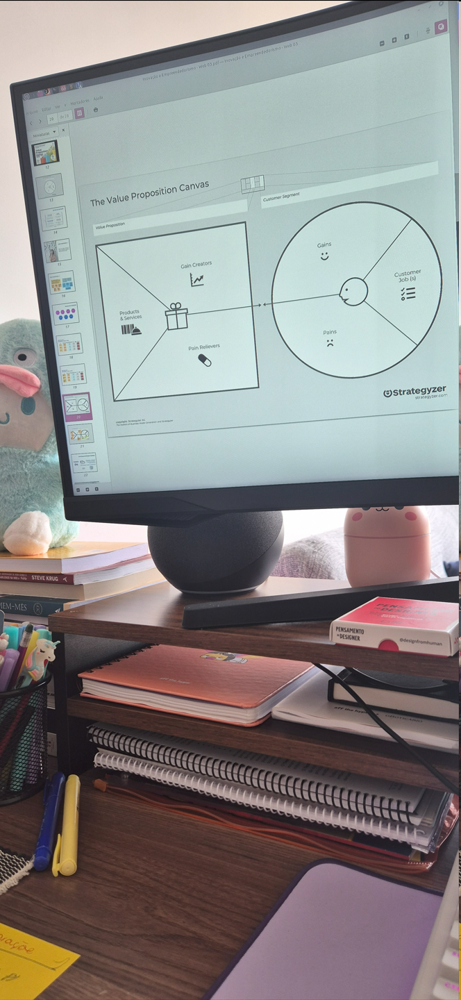

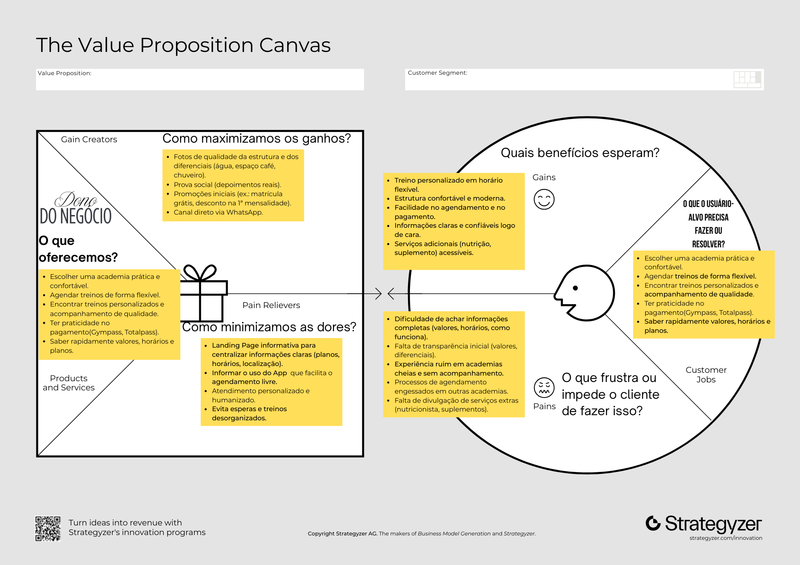

Utilizei também o ChatGPT para estruturar de forma detalhada e organizar todas as informações nos devidos lugares, a fim de não perder o foco nos detalhes.

### ChatGPT

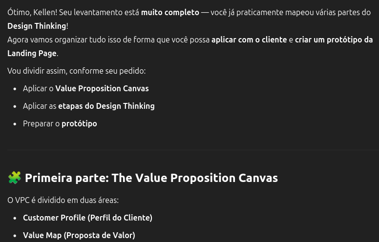

Abaixo, utilizei como um checklist das informações que já havia mapeado, para manter a organização e não me perder no processo:

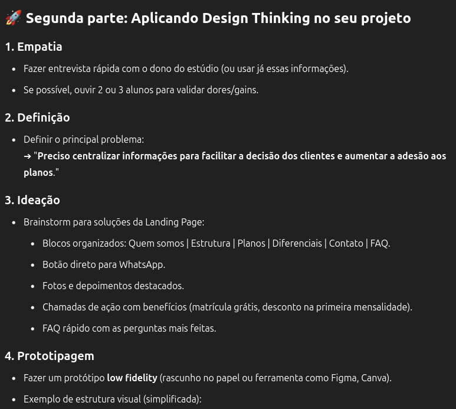

Para tornar a entrevista mais clara, resolvi criar um formulário para enviar ao dono do negócio responder; **isso corresponde às "Definições" citadas e aplicadas aqui.**

---

### 3. Ideação

Visto acima no ChatGPT temos o seguinte:

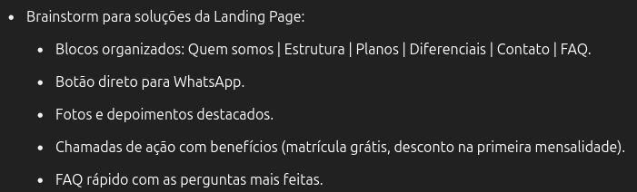

Vou mudar alguns pontos que acho importante reorganizar com base nas necessidades vistas lá no mapeamento com o **Value Proposition Canvas**.

Brainstorm para soluções da Landing Page: EDITADA

- Blocos organizados: Quem somos | Planos Diferenciais | Estrutura | Agendamento - Contato | FAQ
- Botão direto para WhatsApp
- Fotos do ambiente com qualidade - passando credibilidade
- Chamada de Ação: destaque no diferencial do negócio, avaliação gratuita física.
- FAQ rápido com as dúvidas levantadas pelos novos usuários (isso vai ser coletado no formulário).

---

### 4. Prototipagem

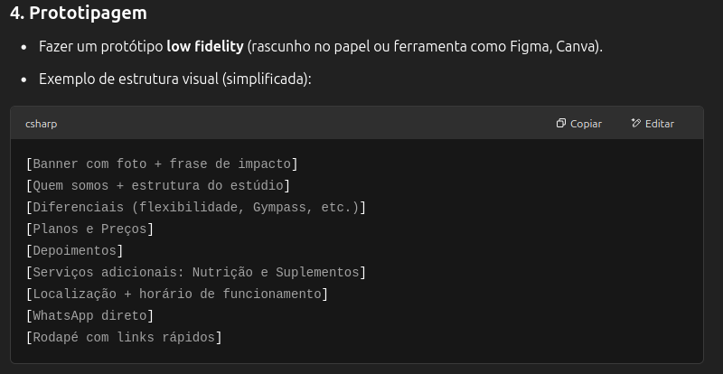

Eu sou péssima com Design 😭 **então utilizei a ferramenta do Canva para dar vida** a isso, e não deixar isso ser meu impedimento.

**OBS**: vamos relembrar brevemente da aula ao vivo sobre "legal, vamos lá fazer isso"

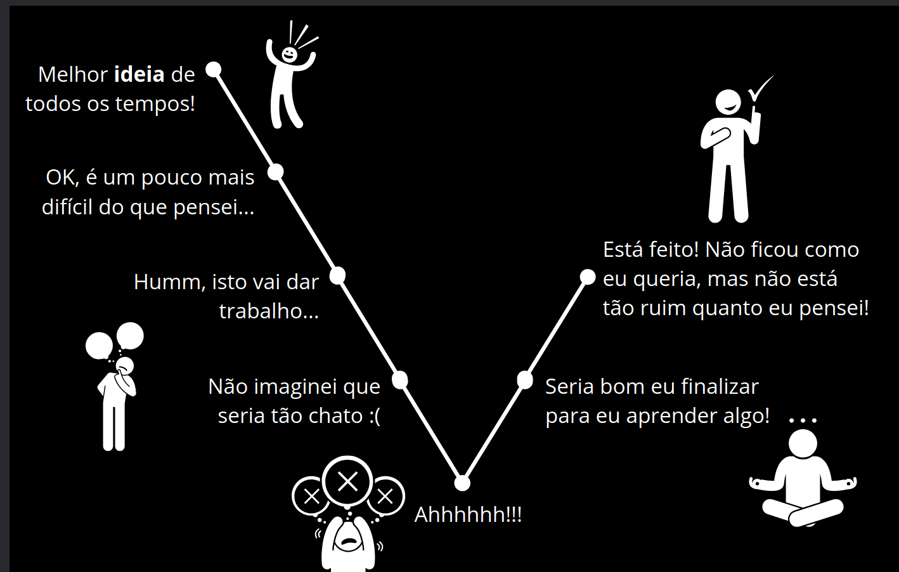

EU não sei design

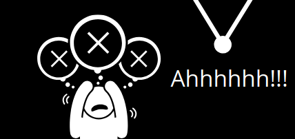

---

## 5. O Teste

Criação do protótipo: como citado, este protótipo foi feito no Canva, com o objetivo de tornar visual todo o planejamento do Value Proposition Canvas. Abaixo, segue a sequência das telas:

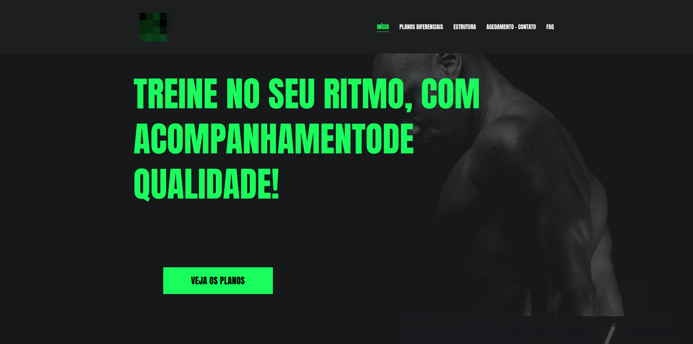

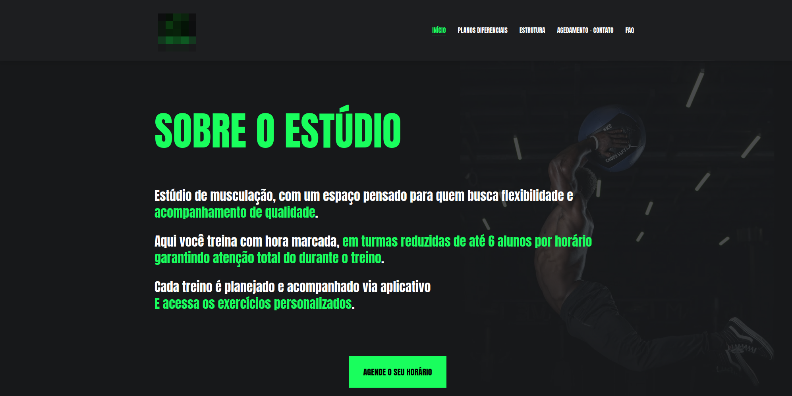

Incluir parte dos serviços que falta para responder do formulário.

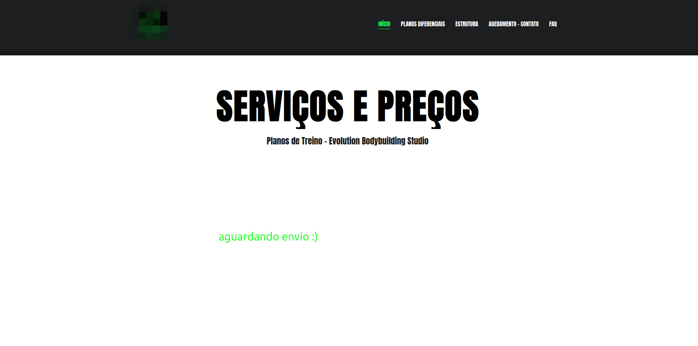

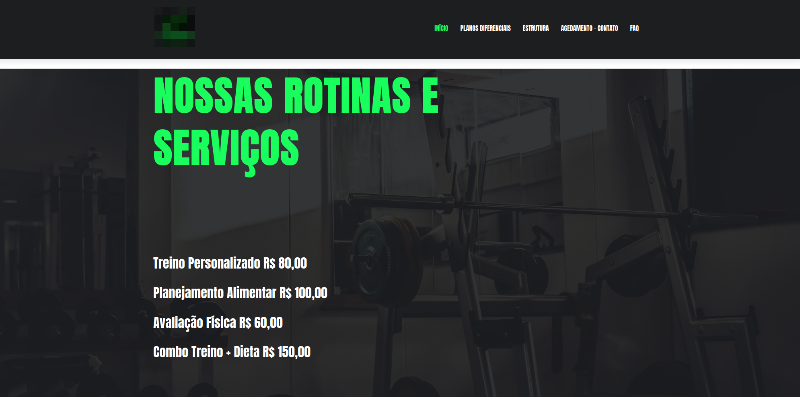

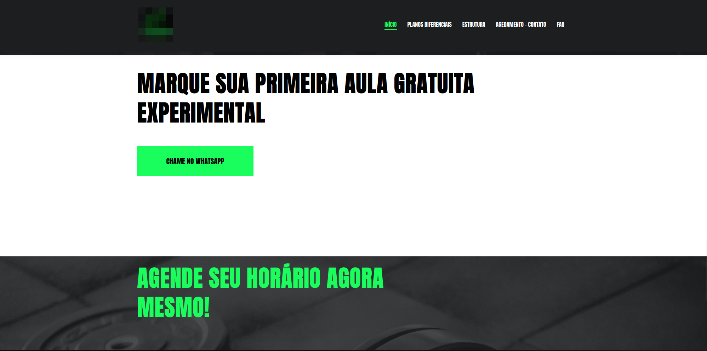

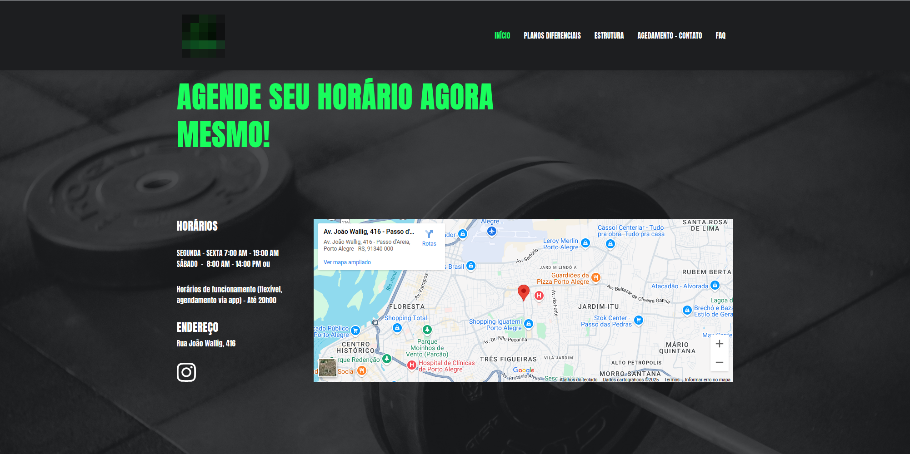

Foi desenvolvido este rascunho inicial do protótipo, com o objetivo de validar as necessidades do proprietário do negócio em relação ao atendimento de seus clientes.

A construção do protótipo possibilitou a identificação de pontos relevantes e, sobretudo, representou um avanço significativo ao transformar ideias em uma versão prática e visual. O processo de desenvolvimento mostrou-se ágil e funcional, permitindo direcionar os próximos passos.

Como continuidade, propõe-se a realização de novos testes com usuários e a execução do site em ambiente real, a fim de avaliar se as funcionalidades implementadas atendem às necessidades previamente mapeadas.

**Protótipo Canva**: [link](https://testeladybug.my.canva.site/cada-rotina-e-pessoa-diferente-por-isso-nos-certificamos-de-que-voc-possa-escolher-um-plano-que-funcione-melhor-para-voc)

---

## Pesquisa em Formulário para melhor análise e entendimento

# 2. Questionário baseado no Design Thinking

(Para usar na fase **Empatia + Definição** com o cliente)

## Perguntas sobre o Negócio

1. Como você descreveria a missão e os valores do seu estúdio?
2. Qual a principal diferença do seu estúdio para outras academias?
3. Quais serviços ou vantagens você mais gostaria de destacar para novos alunos?
4. Qual sentimento ou impressão você gostaria que o aluno tivesse ao visitar o estúdio?

## Perguntas sobre os Clientes

1. Quem são seus principais clientes hoje? (idade, perfil, objetivos)
2. O que seus alunos costumam elogiar mais no seu serviço?
3. **Quais dúvidas ou receios os novos alunos mais demonstram quando entram em contato?**
4. O que já ouviu de feedback positivo ou negativo sobre a experiência na academia?

## Perguntas sobre Comunicação

1. Hoje, quais canais você usa para divulgar seu estúdio? (Instagram, WhatsApp, indicações, etc.)

## Perguntas sobre Serviços Extras

1. Como funciona a parceria com a nutricionista? (valores, agendamento, diferenciais)
2. Como funciona a parceria com suplementos? (marcas, descontos, vantagens)

## Perguntas sobre Experiência

1. Que tipo de benefícios você gostaria de oferecer para novos alunos? (promoções, aula experimental, desconto na 1ª mensalidade)

---

## Links de Referência

**Confira o Protótipo do site**: [https://site-academia-app.vercel.app/](https://site-academia-app.vercel.app/)

Pesquisa de Sites | Mercado com foco em Academias - [Link](/docs/2025/abril/pesquisa-de-sites-mercado-foco-em-academias/)

**Referências de Estudos**:

- **Link** sobre qualidade do produto - Rian Dutra: [LinkedIn](https://www.linkedin.com/posts/riandutra_prestes-a-falir-cortam-o-design-e-marketing-activity-7315692085477539840-InMr)
- Livro: Não me faça pensar - Steve Krug
- Livro: O Design do dia a dia - Donald A. Norman
- Livro: Value Proposition Design - pág: 142, 228, 232
- Pós-graduação Unisinos - Aulas Inovação e Empreendedorismo com a [Profª Rosemary Francisco](https://www.linkedin.com/in/rmaryf)
- Ferramentas: [Canva](https://www.canva.com/), Vercel App para deploy do site
- [Como identificar e resolver pontos de dor (pain points) do usuário no UX Design](https://psicologia.design/como-identificar-e-resolver-pontos-de-dor-user-pain-points-do-usuario-no-ux-design-com-psicologia-aplicada/)
- [Como usar storytelling no UX Design](https://psicologia.design/como-usar-storytelling-no-ux-design/)
