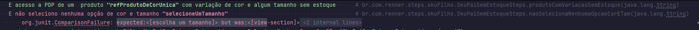

```java
public void suaQuantidadeDeAcordoComTamanhoUltimasPecas(String messageKey) {
    aguardoElementoVisivel(txtUltimosProdutos);
    String textoNaTela = txtUltimosProdutos.getText();
    Assert.assertEquals(getJsonData("Mensagens", messageKey), textoNaTela);
}
```



Abaixo o assert que existe:

```java
public void naoSelecionaNenhumaOpcaoCorETam(String messageKey) {
    quantidadeDeScroll(1);
    //aguardoElementoVisivel(txtTamanhoSku);
    String textoNaTela = txtTamanhoSku.getText();
    Assert.assertEquals(getJsonData("Mensagens", messageKey), textoNaTela);
}
```

**Como deve ser**:

```java
public void naoSelecionaNenhumaOpcaoCorETam(String messageKey) {
    quantidadeDeScroll(1);
    //aguardoElementoVisivel(txtTamanhoSku);
    String textoNaTela = messageKey.getText();
    Assert.assertEquals(getJsonData("Mensagens", messageKey), textoNaTela);
}
```
