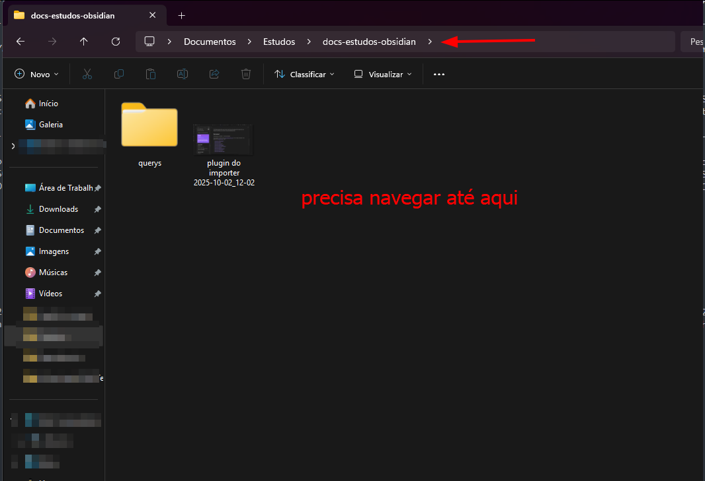
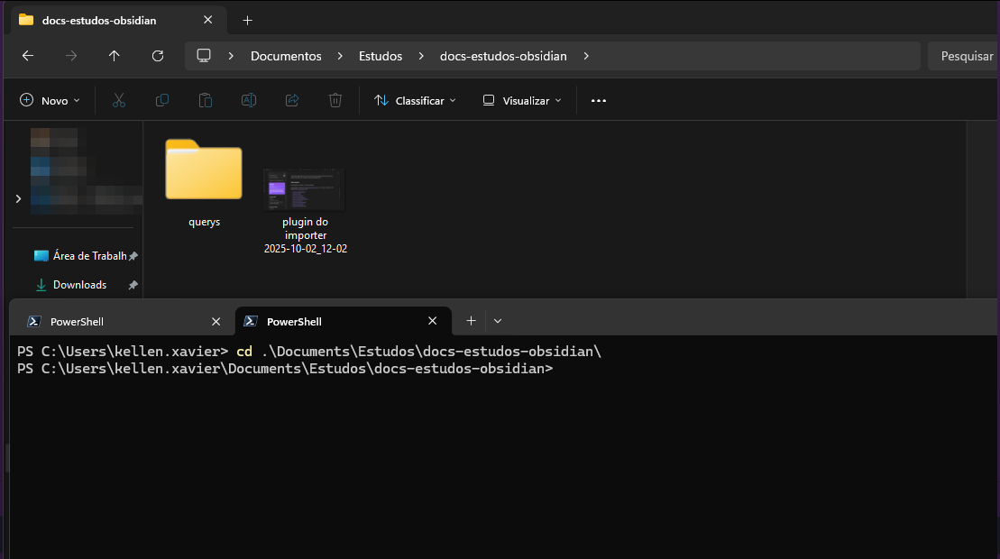

Esse post começou com a ideia de ser somente sobre alguns "comandos de Git" que são práticos no dia a dia. Porém, eu não tinha nada por escrito que reunisse um compilado de estudos sobre o assunto de terminais também: o que é um terminal, como usar um, onde ler mais sobre terminais, antes de entrar em comandos Git.

*Eu sempre comento que é importante saber usar o terminal. Minimamente, precisamos saber usar essas ferramentas; não adianta fugir disso, mesmo que tua IDE seja perfeita e toda visual, pois inevitavelmente vamos ter que lidar com problemas fora da interface visual.*

Eu gosto da metáfora de dirigir um carro, por exemplo: eu imagino como se tu estivesses dirigindo um carro, ele para depois de apitar e tu precisas abrir o capô do carro para ver o que aconteceu. Pode ser um BYD totalmente automático, mas esse carro contém logs, uma caixa-preta — chamada EDR (Event Data Recorder). Aqui vou usar o termo "sujar as mãos" e não ter medo de comandos assim; entender como funciona por baixo dos panos traz uma clareza muito mais profunda.

---

## Alguns Conceitos Base Importantes

### O que é um terminal

Um terminal é uma interface de texto para interação direta com o sistema operacional. Ele envia comandos ao shell (ex.: Bash, Zsh, PowerShell), que interpreta e executa instruções usando as APIs do sistema.

### Fontes sobre Terminais - Lista de leituras e vídeos

[Wikipédia](https://pt.wikipedia.org/wiki/Terminal_(inform%C3%A1tica))
[[Akitando] #70 - Entendendo GIT | (não é um tutorial!)](https://akitaonrails.com/2020/02/05/akitando-70-entendendo-git-nao-e-um-tutorial/)
[[Akitando] #71 - Usando Git Direito | Limpando seus Commits!](https://akitaonrails.com/2020/02/12/akitando-71-usando-git-direito-limpando-seus-commits/)

### Sistema de arquivos e navegação

Quando de modo geral, vamos navegar em um terminal, ou seja, entrar e sair de pastas manipular arquivos, é igual como se fosse navegar em uma tela, mas aqui é por comandos. Quando aqui a gente dizer "faça tal coisa no repositório projeto/automação" estamos comentando que é dentro da pasta em questão.



Visualmente temos, uma tela e onde precisa navegar. Quando abri o terminal (exemplo no ambiente Windows) talvez você veja algo como `C:\Users\meu.nome\Sua-pasta` no exemplo da imagem seria algo como: `C:\Users\kellen.xavier\Documents\Estudos\docs-estudos-obsidian` aqui minha organização pessoal é por em Documentos, dentro da pasta estudo, então aqui quando me referir a "entre no projeto de estudos obsidian, faça o git pull".

Exemplo abaixo uma pasta qualquer, aí tenho que ir só que agora via terminal: se por acaso (a grande maioria abrir o terminal) vai ser algo parecido assim:

```text
PS C:\Users\kellen.xavier>
```

Então vem os comandos para navegar até ele.

### Comandos geralmente mais utilizados

Navegação:

```text
pwd        # mostra o diretório atual
ls         # lista arquivos e pastas
ls -la     # lista detalhada (inclui ocultos)
cd pasta   # entra na pasta
cd ..      # volta um nível
cd ~       # vai para a home
```

**Se clicar aqui na barra conseguimos ver os caminhos a partir de kellen.xavier** (meu caso) → eu estou aqui: `C:\Users\kellen.xavier\Documents\Estudos\docs-estudos-obsidian` então via terminal:

```powershell
cd Documents\Estudos\docs-estudos-obsidian
```

Aqui entrei na pasta:



---

## GIT

Segue abaixo uma sequência de comandos para utilizar, quando se (e principalmente) está trabalhando em projetos com mais de uma pessoa atuando. — Não esquecer —


**Para fazer um merge da sua branch atual para a branch principal ("main"), você pode seguir esses passos:**

```bash
git checkout sua-branch
$ git fetch origin # Puxa as últimas informações do repositório remoto
$ git rebase origin/main
# Atualiza sua branch com as alterações da branch main

$ git rebase origin/main   # Atualiza sua branch com as alterações da branch main
```

**Depois de ter sua branch (de desenvolvimento) atualizada, execute o comando git checkout para mudar para a branch "develop" (ou main):**

```bash
git checkout develop
```

**Agora você está na branch "develop". Realize o merge da sua branch de desenvolvimento usando o seguinte comando:**

```bash
git merge sua-branch
```

---

## Brevemente sobre Pull Request

O objetivo de criar um Pull Request (PR) no GitHub (ou em outras plataformas de controle de versão) **é propor mudanças em um projeto de forma colaborativa e controlada**. Ao criar um Pull Request, você está solicitando que suas alterações em um branch (ramo) específico sejam revisadas e, se aprovadas, incorporadas (mescladas) ao branch principal do projeto, como o main ou develop.

---

**Agora vamos para o seguinte cenário**: se caso você precise trabalhar especificamente com uma branch **que não é a main**, você precisará criar uma nova branch local baseada na branch remota desejada. Suponhamos que você queira trabalhar na branch minha-branch:

**Dado isso, segue o comando git:**

```bash
git checkout -b minha-branch origin/minha-branch-remota-desejada
```

Isso irá criar uma nova branch local chamada `minha-branch` baseada na branch remota `origin/minha-branch-remota-desejada`.

Com esse comando, pode-se trabalhar com a **branch localmente**, e fazer commits e outras operações como de costume.

---

**Comandos do dia-a-dia:**

Antes de tudo, quando for iniciar o desenvolvimento no projeto, atualize seu ambiente local com o seu repositório remoto.

```bash
git pull
```

Ao fazer isso, seu ambiente local se atualiza com as demais alterações feitas pelos colaboradores do projeto em que estão envolvidos.

O comando git pull é usado para buscar (`fetch`) as alterações mais recentes de um repositório remoto e, em seguida, fazer um merge dessas alterações na branch atual em que você está trabalhando. Em outras palavras, ele combina os passos de `git fetch` e `git merge` em um único comando.

Outro exemplo de git pull:

```bash
git pull <remote> <branch>
```

Onde `<remote>` é o nome do repositório remoto de onde você deseja puxar as alterações (geralmente "`origin`") e `<branch>` é a branch remota da qual você deseja puxar as alterações (por exemplo, "`main`", "`develop`", etc.).

### Alterações feitas

Para enviar suas alterações para o repositório remoto, é preciso adicionar, seguindo de um comentário do que foi feito.

Adicionar alteração:

```bash
git add .
```

⚠️ Cuidado ao utilizar o `git add .` pois ele vai adicionar todas alterações realizadas. E isso precisa de atenção. Evite usar, recomenda-se utilizar o:

```bash
git add nome-do-arquivo-ou-pasta
```

Após realizar faça o comentário:

```bash
git commit -m "padrao-de-commit: minha mensagem"
```

**Leia aqui (por link depois) para saber mais sobre padrões de commits.**

Agora, analise o seu terminal, se caso não tiver nenhum erro ou conflito, pode seguir para subir as alterações:

```bash
git push
```

Para mesclar sua branch com a `main` no repositório, faça:

```bash
git merge sua-branch
```

---

## Sobre git stash

O comando `git stash` é utilizado para armazenar temporariamente as alterações que você fez no seu diretório de trabalho, permitindo que você volte ao estado anterior do repositório sem precisar fazer commit das alterações. Isso é útil quando você deseja alternar rapidamente entre diferentes tarefas ou branches sem comprometer as alterações que não estão prontas para serem confirmadas.

Aqui estão alguns exemplos de como você pode usar o `git stash`:

**Armazenar Alterações Temporariamente:** se você fez algumas alterações no seu diretório de trabalho, mas ainda não deseja commitá-las, você pode usar o seguinte comando para armazená-las temporariamente:

```bash
git stash save "Descrição opcional"
```

A descrição é opcional e pode ajudar a identificar por que você armazenou essas alterações.

**Listar Stashes:** você pode listar os stashes que você criou usando o seguinte comando:

```bash
git stash list
```

**Aplicar Stash:** para aplicar o stash mais recente (ou um `stash` específico), você pode usar:

```bash
git stash apply           # Aplica o stash mais recente
git stash apply stash@{n} # Aplica um stash específico pelo seu índice
```

**Remover Stash:** depois de aplicar um stash, você pode removê-lo:

```bash
git stash drop           # Remove o stash mais recente
git stash drop stash@{n} # Remove um stash específico pelo seu índice
```

**Criar uma Nova Branch a partir do Stash:** se você quiser criar uma nova branch baseada em um stash, pode usar:

```bash
git stash branch nova-branch  # Cria uma nova branch e aplica o stash nela
```

---

**Outros pontos importantes:**

Atualize sua **branch** com **as últimas alterações da branch principal** ("main"). Isso ajudará a **evitar conflitos durante o merge**. Execute os seguintes comandos:

```bash
git fetch origin # Puxa as últimas informações do repositório remoto

git rebase origin/main   # Atualiza sua branch com as alterações da branch main
```

⚠️ **Atenção**

Não faça git pull nessas situações. Leia novamente o que é **git pull**.
