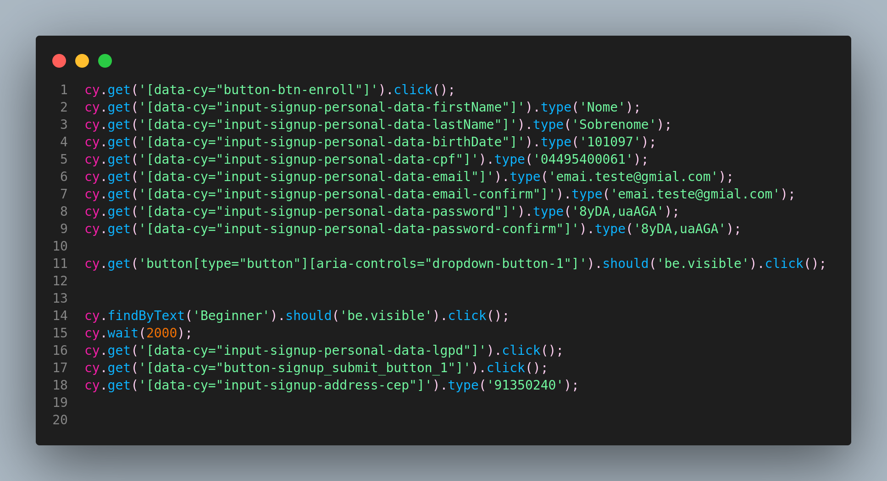

Segue exemplo abaixo de um código que usa o `data-cy` para capturar elementos nas automação E2E com Cypress.

---

O uso do **Testing Library** é interessante quando não temos o elemento definido no E2E, ou seja, sem o data-test/cy. Para que o Testing Library reconheça dentro da automação, precisamos que, não tenha no elemento que vai ser buscado pelo cypress o `data-cy` e então, o Testing Library o reconhece buscando pelo padrão `findByText.('Sua palavra mágica').click();`



**Opção 1: Configurar no arquivo `setup-tests.js` (Cypress v10+):**

1. Crie o arquivo `setup-tests.js`: se você ainda não tem esse arquivo, crie-o na raiz do seu projeto ou em outro local especificado na sua configuração do Cypress (veja a documentação para detalhes).
2. Configure o atributo `testIdAttribute`:

```javascript
// cypress/support/setup-tests.js
import { configure } from '@testing-library/cypress';

configure({ testIdAttribute: 'data-cy' })
```

**Opção 2: Configurar diretamente no teste (Cypress v9 e anteriores):** se você estiver usando uma versão mais antiga do Cypress, você pode configurar a biblioteca diretamente no seu arquivo de teste:

```javascript
// cypress/e2e/seu_teste.cy.js
import { configure } from '@testing-library/cypress';

// ...

describe('Seus testes', () => {
  before(() => {
    configure({ testIdAttribute: 'data-cy' })
  })

  // ... seus testes aqui
})
```

**Opção 3: Criar um novo comando:**

Crie um comando personalizado para usar `findByTestId` sempre com o `data-cy`:

```javascript
// cypress/support/commands.js
Cypress.Commands.add('findByCy', (value, options) => {
  cy.findByTestId(value, { ...options, testIdAttribute: 'data-cy'})
})
```

---

**Referências**:

[Testing Library](https://testing-library.com/docs/cypress-testing-library/intro/)

<https://github.com/testing-library/cypress-testing-library/blob/97939da7d4707a71049884c0324c0eda56e26fc2/cypress/integration/find.spec.js>

**Cypress and Testing Library** [Link](https://docs.cypress.io/app/core-concepts/best-practices#Cypress-and-Testing-Library)
