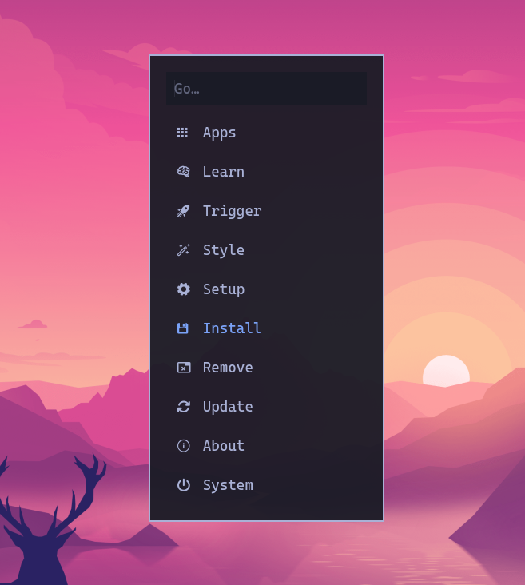
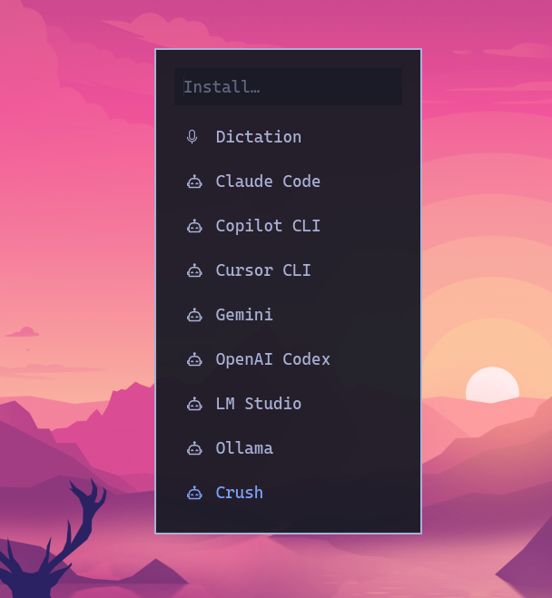
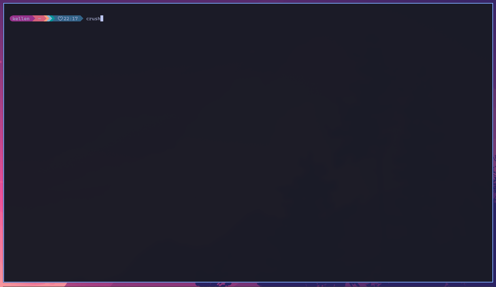
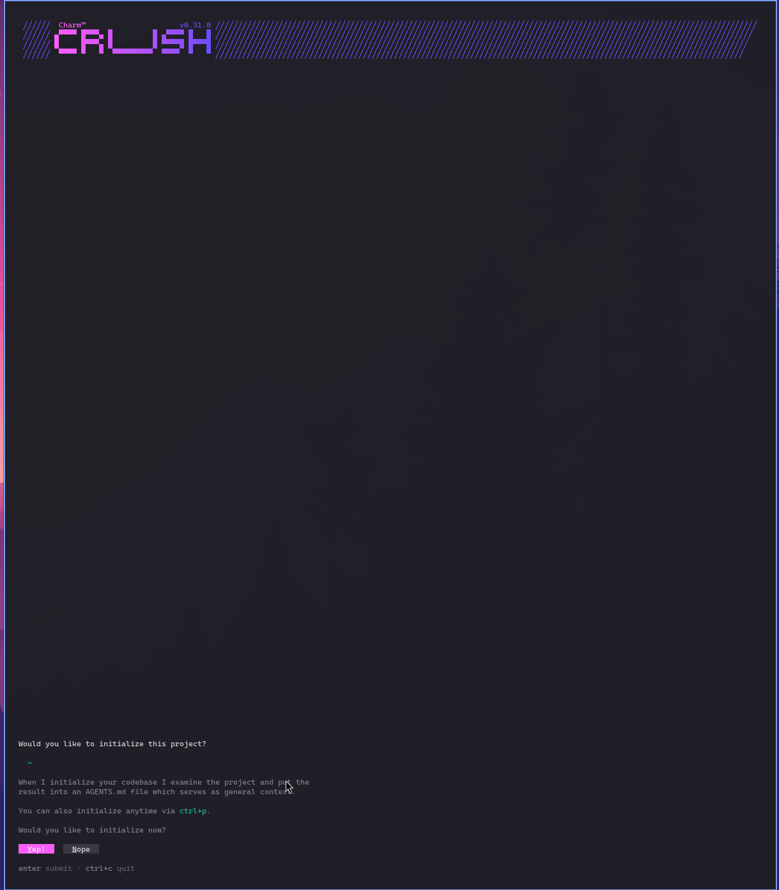
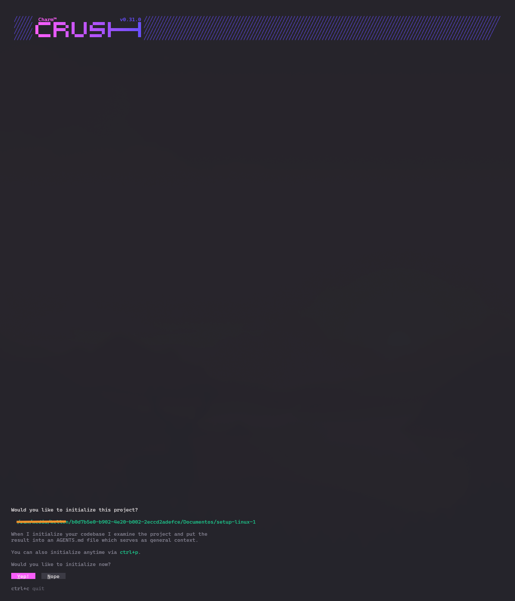
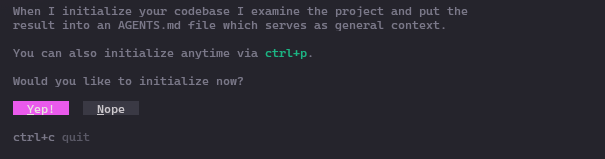

Estava acompanhando algumas atualizações e também estou estudando mais sobre terminais de comando — resolvi entrar de cabeça no universo de terminais depois de ler sobre TUIs, do inglês **Terminal User Interfaces** ou *Text-based User Interfaces*. Então acabei descobrindo o CRUSH via update do sistema do Omarchy e no [post do DHH](https://world.hey.com/dhh/promoting-ai-agents-3ee04945) e na sequência o [Akita](https://akitaonrails.com/2026/01/09/omarchy-3-um-dos-melhores-agentes-pra-programacao-crush/) também — 😅 acompanho os dois em jornadas de estudos tech. Ainda não testei o [OpenCode](https://opencode.ai/), depois crio uma nota sobre ele aqui. Abaixo seguem notas pessoais e estudo do CRUSH.

**O que é o CRUSH**: um agente de codificação assistido por IA, porém com o diferencial que ele é projetado para rodar via CLI (CLI / TUI). É uma ferramenta de produtividade para desenvolvedores, oferece suporte para: escrever código, depuração, operações em arquivos de repositórios. Ele utiliza metalinguagem de LLM (Large Language Models) que é definido diretamente pelo usuário da máquina. Suporte a: OpenAI, Claude, Gemini etc.

---

## Instalação e configuração

No sistema que estou utilizando, o [Omarchy](https://omarchy.org/), ele vem com o CRUSH como opção para instalar nas configurações dele.

Então eu simplesmente selecionei a opção e segui a instalação, em seguida no terminal executei o comando `crush`.

Configurei a chave da [API aqui neste tutorial](https://platform.openai.com/docs/quickstart?desktop-os=macOS): clicar em "criar chave de API", gerar e colar no crush após selecionar o seu LLM.

---

Para esse teste, com o crush peguei o seguinte [repositório setup-linux-mint](https://github.com/kellen-xavier/setup-linux) para fazer uma refatoração. Para isso fui até o caminho do repo localmente, executo o comando crush. Então segue a tela de inicialização.

Veja a frase abaixo: opção de analisar todo o projeto e mostrar o resultado. Porém precisa do arquivo `AGENT.md`.

### Criando o arquivo para o projeto
