Seguindo a **saga de estudos em Terminais/TUIs**, aqui vamos para o entendimento sobre o CRUSH em uma máquina Windows: como foi que configurei e como está sendo o uso até o momento, realizando um teste com um repositório open source bem simples, voltado à configuração de ambiente de desenvolvimento no Windows.

**Objetivo principal**

Permitir que desenvolvedores tenham **assistência de IA diretamente no terminal**, sem precisar alternar para um editor web ou **IDE com plugins integrados** — ou melhor, mais leve ao executar, por exemplo, do que o VS Code. O que a ferramenta oferece:

- Integração com **múltiplos provedores de modelos de IA**
- **Sessões** com contexto preservado por projeto
- Interface **TUI (Text User Interface)** interativa opcional
- **CLI tradicional** para automação ou uso em scripts
- Extensibilidade via padrões como **Agent Skills** e **MCP** (Model Context Protocol)

**Fonte**: [github crush](https://github.com/charmbracelet/crush)

### Segue abaixo o primeiro teste em ambiente Windows

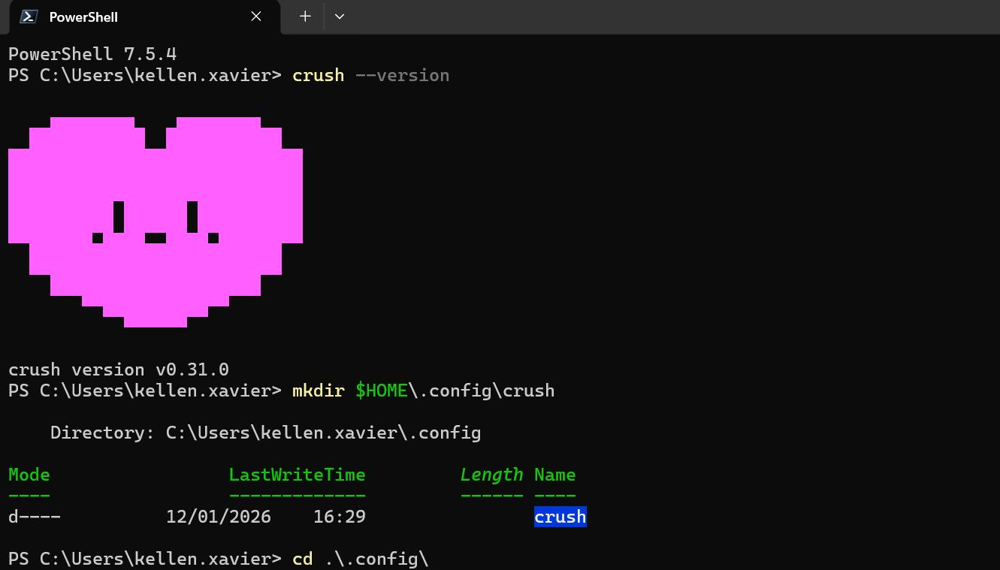

---

## A usabilidade em uma máquina com OS Windows

**Instalação**: via PowerShell optei por seguir o comando

```
# NPM
npm install -g @charmland/crush
```

Neste caso, foi tranquilo, para fazer integração com [API da OpenAI](https://openai.com/pt-BR/api/) primeiro precisa criar a [chave da API](https://platform.openai.com/api-keys), eu segui o [tutorial deles aqui](https://platform.openai.com/docs/quickstart?desktop-os=windows) voltado para o windows nesse caso. Então nesse caso, copie a sua chave e reserve em um bloco de Notas. No Windows após instalação do CRUSH, no seguinte caminho: `C:\Users\SEU_USER` conforme o Windows tudo fica sob esse caminho `C:\Users\<SEU_USUARIO>\.config\crush\`

Caso ainda não exista essa pasta, então crie: `mkdir $HOME\.config\crush` então pode seguir, fazendo a integração com uma IA — no caso aqui provedor OpenAI — abaixo os comandos para criar uma variável de ambiente primeiro via terminal PowerShell.

### Criar variável de ambiente

`setx OPENAI_API_KEY "sua_chave_aqui"`

Como de costume, feche sempre o terminal e inicie um novo, verifique com o comando: `echo $Env:OPENAI_API_KEY`

Segue para verificar se o Crush está funcionando: `crush --version` e caso mostrada a versão segue para o uso:

```powershell
crush
```

O terminal PowerShell irá carregar a UI da ferramenta então pode iniciar o uso. Neste exemplo de testes eu decidi refatorar um projeto de setup para Windows: <https://github.com/kellen-xavier/scripts-config-windows> — particularmente não muito interessante mas necessário, e também útil quando precisar reinstalar o mesmo — aqui eu primeiro via VS Code baixei o repositório — sim, neste caso utilizei por agora o editor, mas com os demais [plugins do charmbracelet](https://github.com/charmbracelet) pode-se personalizar; o foco aqui não é esse.

### Para os usos práticos

Perguntar sobre código do projeto atual: neste caso fui até a pasta do meu projeto

```powershell
cd meu-projeto
crush
```

Primeira pergunta pedi para analisar o projeto: de forma mais geral, tipo possíveis bugs. Após ele me responder as respostas.

> analyze possible errors

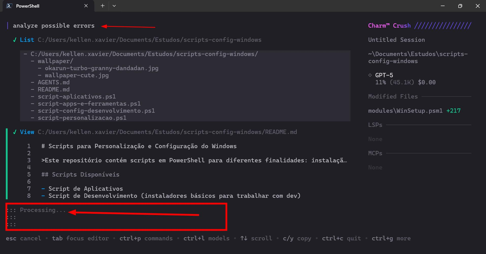

Eu tinha esquecido de criar o arquivo [AGENT.md](https://github.com/kellen-xavier/scripts-config-windows/blob/main/AGENTS.md), o próprio CRUSH recomenda isso em tela, mas aí fui lá criar.

```powershell
# Arquivo de script PowerShell para configuração Windows
Repositório de scripts voltado para Windows: instalar e personalizar via Shell Script. Este repositório foi criado com o intuito de facilitar a instalação de Aplicativos Windows. Criar o arquivo programas-new-apps.ps1

## REGRAS: O script deve conter
- Implementar Testes com Pester
- Usar análise estática de código
- Usar winget como gerenciador principal
- Instale programas com segurança usando winget
- Verificar se o winget está instalado
- Instalar programas de forma idempotente (não reinstalar se já existir)
- Usar parâmetros silenciosos
- Gerar log de execução
- Falhar de forma segura em caso de erro
- Não baixar executáveis diretamente da internet
- Seguir boas práticas de segurança no Windows
- Download e Execução de Script Externo com validação (Win11Debloat)
- Instalar gerenciadores de versão (Instalação de Múltiplas Versões do Java/Node.js)
- Deve conter blocos de help
- Script verifica conectividade antes de tentar downloads
- Adicionar Suporte a -WhatIf e -Confirm
- Transformar scripts em módulo PowerShell com funções reutilizáveis
- Consistência nos Nomes dos Scripts
- Verificação de Código de Saída (uso de $LASTEXITCODE para validar sucesso das operações winget)
- Feedback Visual ao Usuário (uso de Write-Host com cores para indicar status das operações)
- Todos os scripts principais possuem verificação de permissões administrativas no início

## Liste exemplos comuns de software

### Trabalho uso VPNs
- VPN: Netskope Client

### Aplicativos
Android Studio, BlueStacks 5, Bitwarden, Cursor, Docker Desktop, DBeaver Community, Discord, Flameshot, Global VPN Cliente, LibreOffice, Powershell, PowerToys Awake, Intellij IDEA Community Edition, ScreenToGif, sqldeveloper, Sublime Text Free, Teams, Insomnia, Obsidian, VS Code, Visual Studio Installer, Logitech G Hub

### Navegadores
Google Chrome, Edge, Firefox, Opera

### Linguagens Desenvolvimento
- JAVA 11, 17, 18+
- NodeJS
- Python

## Documentação README.md
- Especifica versão mínima do Windows 10 (requer 1809+ para winget)
- Necessidade do App Installer atualizado
- Seção de troubleshooting

### Registry com Backup
```shell
$BackupPath = "$PSScriptRoot\backup\registry-$(Get-Date -Format 'yyyyMMdd-HHmmss').reg"
reg export "HKCU\Software\Microsoft\Windows\CurrentVersion\Themes\Personalize" $BackupPath
```

## PRIORIDADES DE CORREÇÃO PARA OS SCRIPTS EXISTENTES

- Prioridade 1 (Segurança): adicionar validação de hash para Win11Debloat, criar backup do registro antes de alterações, implementar Try-Catch em todos os scripts
- Prioridade 2 (Funcionalidade): implementar logging persistente, adicionar verificação de pré-requisitos, corrigir comando de navegador padrão
- Prioridade 3 (Manutenibilidade): adicionar parâmetros aos scripts, implementar idempotência, adicionar comment-based help

## Referências

- [Examples of Comment-based Help](https://learn.microsoft.com/en-us/powershell/scripting/developer/help/examples-of-comment-based-help?view=powershell-7.5)
- [Native interoperability best practices](https://learn.microsoft.com/en-us/dotnet/standard/native-interop/best-practices)
- [Approved Verbs for PowerShell Commands](https://learn.microsoft.com/en-us/powershell/scripting/developer/cmdlet/approved-verbs-for-windows-powershell-commands?view=powershell-7.5)
- [PSScriptAnalyzer](https://github.com/PowerShell/PSScriptAnalyzer)
- [The test framework for Powershell](https://pester.dev/)
- [Starting Windows PowerShell](https://learn.microsoft.com/en-us/powershell/scripting/windows-powershell/starting-windows-powershell?view=powershell-7.4#with-administrative-privileges-run-as-administrator)
```

Tentei por tudo o que entendi ser o correto desta vez para criar o setup, eu tive que ler as referências também para entender as boas práticas em torno disso, importante entender exatamente como vai montar o arquivo do AGENT pois ele fica mais estruturado.

**Agora solicitei para executar o arquivo do AGENT**: based on the AGENT.md file execute

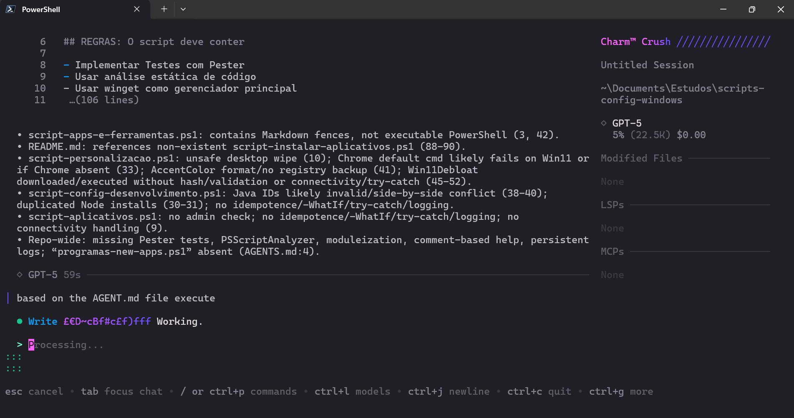

Com base no primeiro comando ele retornou:

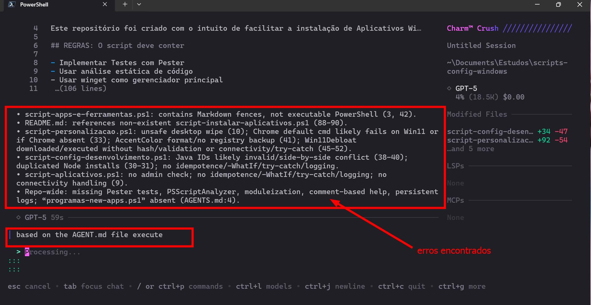

Processando o arquivo AGENT:

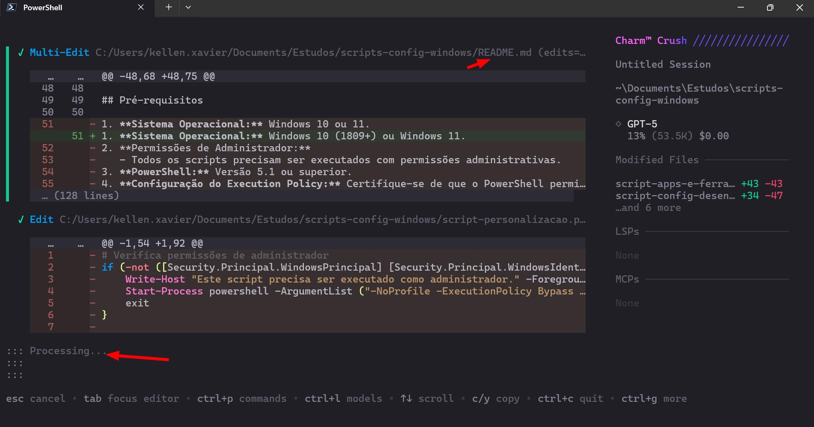

No VS Code quis dar uma olhada em como ele estava se comportando:

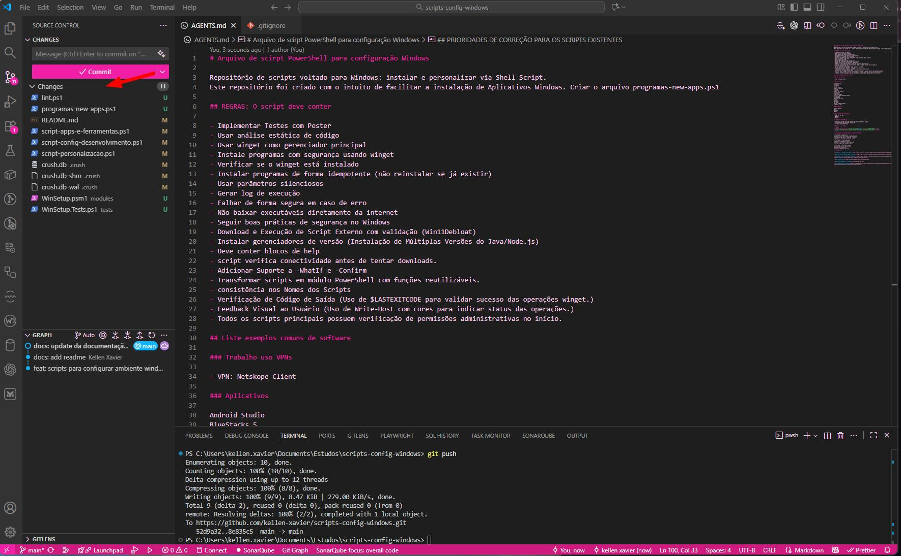

Executando Lint:

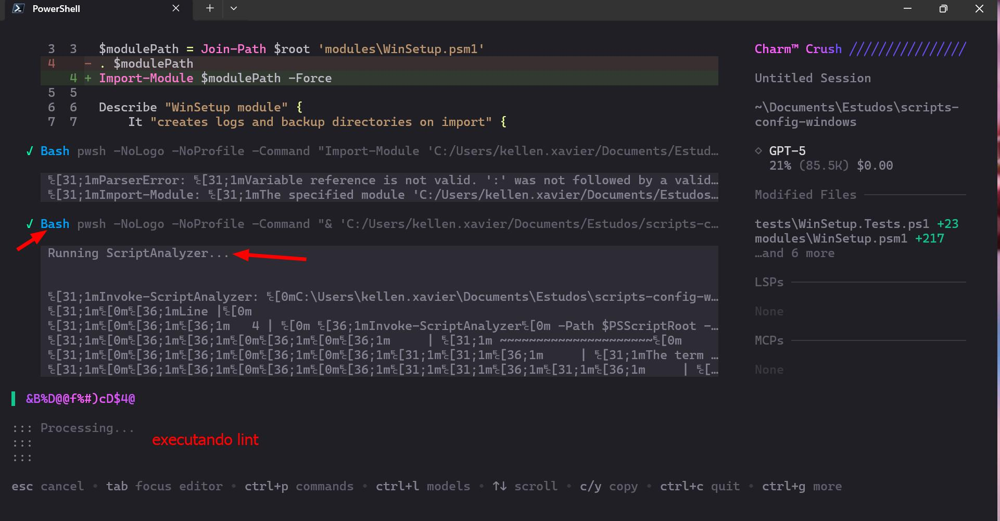

Executando Testes:

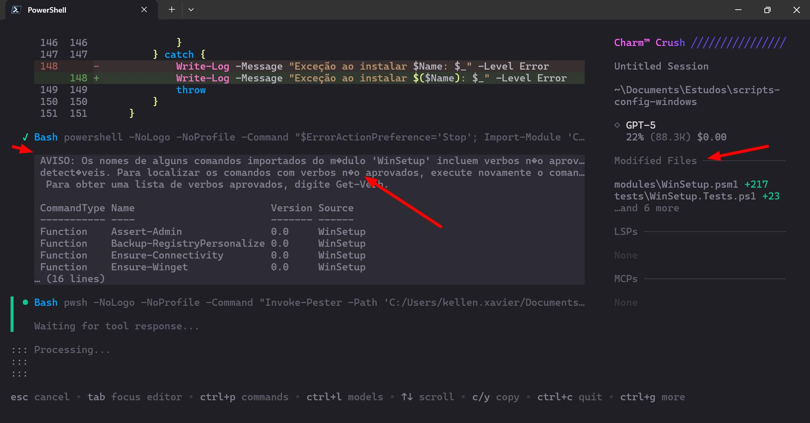

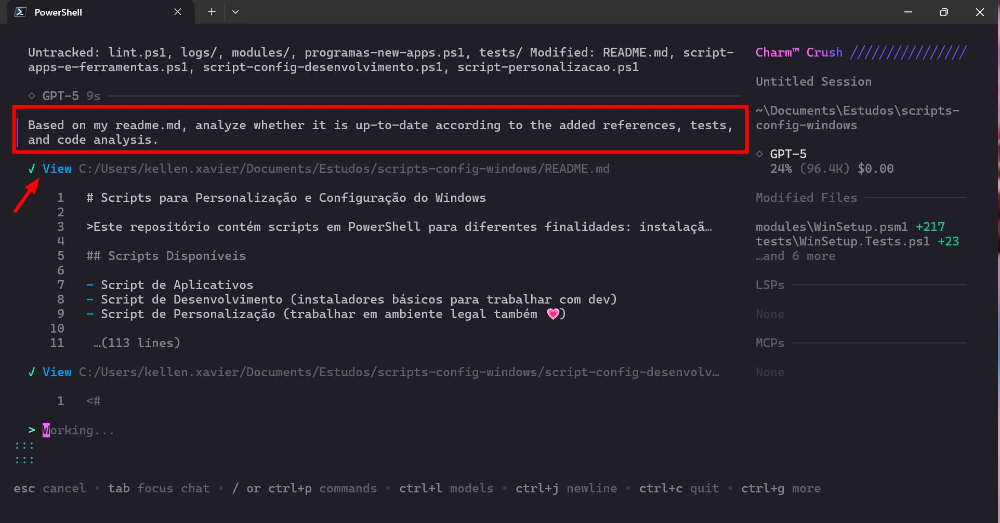

Solicitei para fazer um update do README.md:

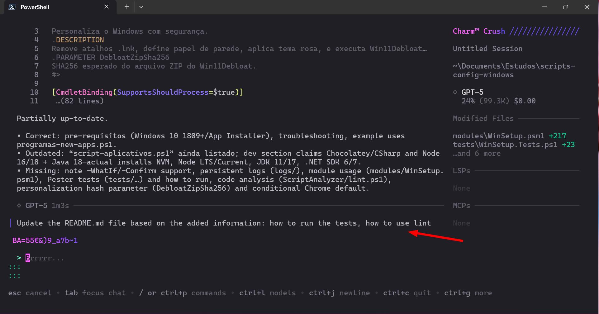

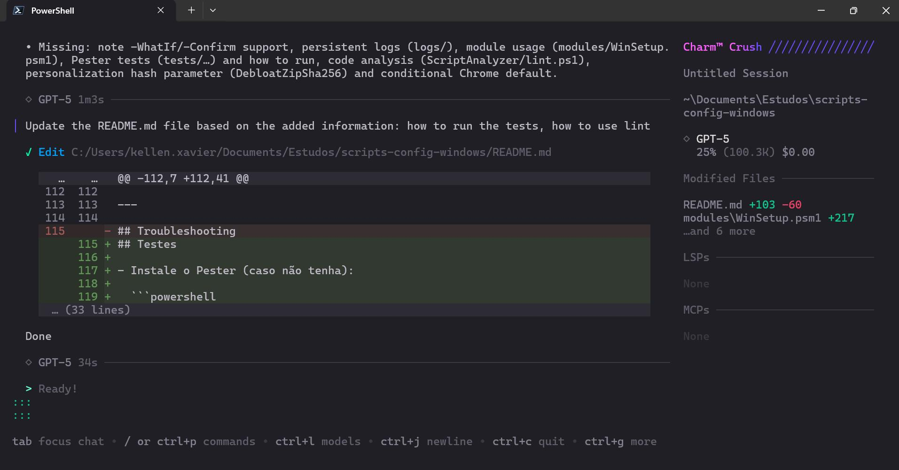

Estrutura final do projeto:

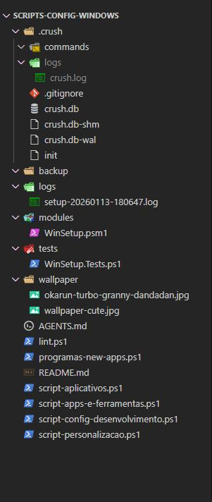
