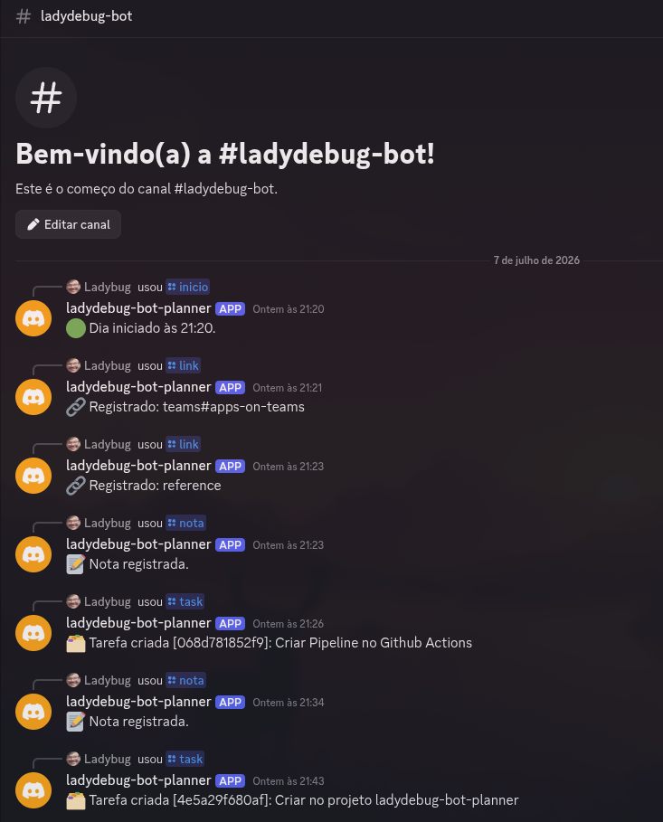
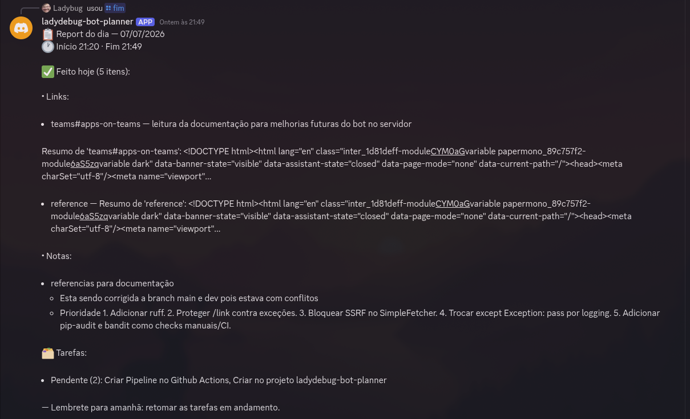
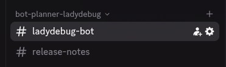
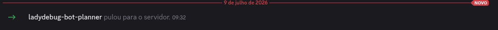
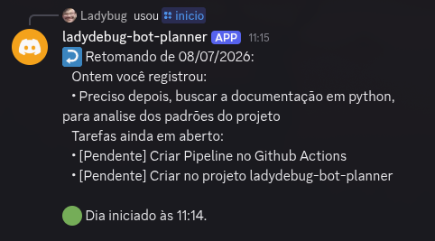
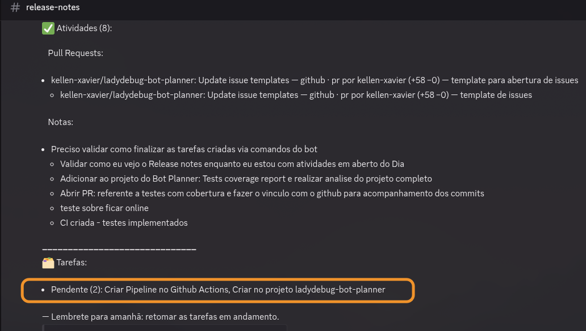

Recentemente estive a desenvolver alguns projetos de estudos com IA, e estava precisando me organizar, de, quanto tempo estive a desenvolver — tempo corrido —

também ao esta desenvolvendo algo geralmente eu costumo ler a documentação da lingagem para leitura de algumas práticas, links de documentos, docs que eu estou escrevendo para determinada característica do projeto. Criar tarefas que me lembrei no ato que estava a desenvolver, e verifiquei que pode ser terminada logo após a tarefa que estou a fazer. Além de comentários do que foi realizado, esse acompanhamento de forma geral.

Com base nesse problema, pensei em algo prático que eu possa fazer enquanto estou desenvolvendo. Ou seja comando `/inicio` quando inicio a atividade, `/link` para adicionar documentações entre outros importantes. `/nota` quando eu quiser adicionar notas comentários, `task` para quando quiser criar uma tarefas, `fim` quando finalizar tudo. Após isso gere um `Release notes` com o que foi feito e quais as tarefas ficaram pendentes.

Então lendo uma [postagem em um blog](https://akitaonrails.com/2026/02/16/vibe-code-do-zero-a-producao-em-6-dias-the-m-akita-chronicles/#spoiler-do-processo) e pensei em criar o bot com gestão pessoal para auxiliar no ciclo de desenvolvimento pessoal sem fricção e que gere um report notes no fim do trabalho.

Podendo também aplicar para compartilhar caso queira com alguém do time (desenvolvimento orientado com metodologia XP).

---

Criei o repositório no github <https://github.com/kellen-xavier/ladydebug-bot-planner> ~~inicialmente privado mas irei liberar em seguida~~, open-source — estou a corrigir algumas questões de segurança — e primeiro criar o bot, inicialmente interação é via Discord, mas vai abranger multicanal de comunicação (pensei em slack e dicord principal) as demais particularmente não me interessei muito.

## Primeira Fase do desenvolvimento





Nos testes iniciais, ficou bem poluído os comandos no chat unificado, então pensei em criar um segundo “canal de texto”, para que o release-notes separado para acompanhar no dia seguinte, tendo essa visão limpa entre “comandos” e “release notes”.



---

### **Organização do Bot**

Para configurar o bot é simples, deve-se seguir a documentação oficial neste link: [**Building your first Discord Bot**](https://docs.discord.com/developers/quick-start/getting-started)



**Para estes estudo de caso |  Como configurar o Bot:**

1. Vá no Developer Portal do Discord.
2. Abrir o app ladydebug-bot-planner.
3. Vá em Bot.
4. Clique em Reset Token.
5. Copie o token novo.
6. Atualize DISCORD_TOKEN no .env.
7. Rode de novo:

   ```bash
   set -a; source .env; set +a
   python -m daily.main
   ```

8. Configuração Mínima Local

Seu .env local deve ter pelo menos:

`DISCORD_TOKEN=token_do_bot
DISCORD_GUILD_ID=807481361916100628
DB_PATH=daily.db`

---

### Plano de Testes Bot Planner

Visão geral

**Checklist**:

#### Todos

[•] Mapear módulos e funcionalidades existentes em src/daily
[ ] Mapear testes existentes por funcionalidade
[ ] Executar testes/cobertura disponível
[ ] Consolidar lacunas de cobertura e recomendações

### Funcionalidades Com Testes

Criei o report em docs/TEST_COVERAGE_REPORT.md aqui ele documenta o seguinte:

- Estado atual da suíte: 79 passed.
- Diretrizes para evitar testes enviesados/falso positivo.
- Lacunas restantes por prioridade.
- Cenários exatos que precisam ser implementados.
- Critérios de aceite para novas rodadas.
- Recomendação para adicionar pytest-cov.
- Ordem sugerida de execução.

**Principais áreas priorizadas no report:**

1. CommandRouter
2. SqliteStorage
3. SimpleFetcher
4. VCS adapters
5. Report de fim de dia
6. Discord adapter callbacks
7. Models/DTOs
8. Métrica objetiva com coverage

---

**Erros encontrado:**

```jsx
python -m daily.main
2026-07-09 09:32:45 INFO     discord.client logging in using static token
2026-07-09 09:32:47 INFO     discord.gateway Shard ID None has connected to Gateway (Session ID: b25a5b78274ede64c286f2fc11e8c2e3).
Bot online como ladydebug-bot-planner#3088
2026-07-09 09:51:05 ERROR    discord.app_commands.tree Ignoring exception in command 'inicio'
Traceback (most recent call last):
  File "/home/kellen/Documents/Projetos github/ladydebug-bot-planner/.venv/lib/python3.14/site-packages/discord/app_commands/commands.py", line 859, in _do_call
    return await self._callback(interaction, **params)  # type: ignore
           ^^^^^^^^^^^^^^^^^^^^^^^^^^^^^^^^^^^^^^^^^^^
  File "/home/kellen/Documents/Projetos github/ladydebug-bot-planner/src/daily/adapters/discord_bot.py", line 90, in inicio
    msg = router.inicio(str(interaction.user.id), str(interaction.channel_id))
  File "/home/kellen/Documents/Projetos github/ladydebug-bot-planner/src/daily/command_router.py", line 32, in inicio
    s = self._day.start_day(user_id, channel_id)
  File "/home/kellen/Documents/Projetos github/ladydebug-bot-planner/src/daily/core/day_service.py", line 32, in start_day
    raise DayAlreadyOpen("Já existe um dia aberto para este usuário.")
daily.core.day_service.DayAlreadyOpen: Já existe um dia aberto para este usuário.

The above exception was the direct cause of the following exception:

Traceback (most recent call last):
  File "/home/kellen/Documents/Projetos github/ladydebug-bot-planner/.venv/lib/python3.14/site-packages/discord/app_commands/tree.py", line 1302, in _call
    await command._invoke_with_namespace(interaction, namespace)
  File "/home/kellen/Documents/Projetos github/ladydebug-bot-planner/.venv/lib/python3.14/site-packages/discord/app_commands/commands.py", line 884, in _invoke_with_namespace
    return await self._do_call(interaction, transformed_values)
           ^^^^^^^^^^^^^^^^^^^^^^^^^^^^^^^^^^^^^^^^^^^^^^^^^^^^
  File "/home/kellen/Documents/Projetos github/ladydebug-bot-planner/.venv/lib/python3.14/site-packages/discord/app_commands/commands.py", line 877, in _do_call
    raise CommandInvokeError(self, e) from e
discord.app_commands.errors.CommandInvokeError: Command 'inicio' raised an exception: DayAlreadyOpen: Já existe um dia aberto para este usuário.
```

**Motivo**:

DayAlreadyOpen: Já existe um dia aberto para este usuário.
Isso acontece porque você executou /inicio, o bot abriu uma sessão no daily.db, e depois você chamou /inicio de novo sem antes fechar com /fim.

**Explicação**:

Causa Técnica
O core está correto em impedir dois dias abertos:
if self._storage.get_open_session(user_id) is not None:
raise DayAlreadyOpen("Já existe um dia aberto para este usuário.")
O problema é que essa exceção está vazando até o Discord, gerando stack trace. O bot deveria responder algo amigável, como:
Já existe um dia aberto para você. Use /fim para fechar antes de iniciar outro.

**Correções:**

Plano De Ajustes
Ainda em modo planejamento, então não vou editar arquivos agora. O ajuste recomendado é:

1. Tratar DayAlreadyOpen no CommandRouter.inicio.
2. Tratar NoOpenDay em /nota, /link e /fim.
3. Evitar que exceções esperadas do core virem erro no Discord.
4. Melhorar diagnóstico de ambiente Discord com DISCORD_CLIENT_ID.
5. Documentar configuração local e produção no README.
6. Adicionar testes para esses casos.

## Comportamento Esperado Após Ajustes

Validar `/inicio` com dia já aberto mas sem terminar atividades:
Deve retornar:
Mensagem:
🟡 Já existe um dia aberto para você. Use `/continuar` para seguir o seu dia.
Comportamento: ao enviar comando `/continue` deve seguir inserindo as atividades, do dia. Ou seja;

**Cenário**:
Dado que usuário envia o comando /iniciar no dia 1
E no dia 1 usuário envia o comando /iniciar
Quando retornar a mensagem: 🟡 Já existe um dia aberto para você. Use `/continuar` para seguir o seu dia.
Então usuário deve inserir comando /continuar
E deve seguir até finalizar o dia

Validar `/nota` sem dia aberto:
Deve retornar:
Mensagem: ⚠️ Nenhum dia aberto. Use /inicio primeiro.

Validar `/fim` sem dia aberto:
Deve retornar:
Mensagem: ⚠️ Nenhum dia aberto para fechar. Use /inicio para começar.

Validar `/link` sem dia aberto:
Deve retornar:
Mensagem:
⚠️ Nenhum dia aberto. Use /inicio primeiro.

1. Arquivos Que Devem Mudar

- src/daily/command_router.py
- src/daily/adapters/discord_bot.py
- src/daily/main.py
- .env.example
- [README.md](http://readme.md/)
- tests/test_ingest_and_report.py
- tests/test_discord_bot.py
- tests/test_main_config.py

**O Que Mudou:**

- src/daily/command_router.py
- /inicio com dia já aberto agora retorna:
  🟡 Já existe um dia aberto para você. Use /continuar para seguir o seu dia.
- Novo método continuar.
- /nota, /link e /fim agora tratam NoOpenDay com mensagens amigáveis.
- /link agora verifica dia aberto antes de buscar/resumir URL.
- src/daily/adapters/discord_bot.py
- Adicionado comando Discord /continuar.
- Melhorado diagnóstico quando o bot não vê o servidor.
- Se DISCORD_CLIENT_ID estiver configurado, o erro imprime URL de convite correta.
- src/daily/main.py
- Adicionada validação de ambiente:
  DISCORD_TOKEN obrigatório.
  DISCORD_GUILD_ID numérico se informado.
  DISCORD_CLIENT_ID numérico se informado.
- .env.example
- Adicionado DISCORD_CLIENT_ID.
- [README.md](http://readme.md/)
- Documentado /continuar.
- Documentado ambiente local e produção.
- Adicionado troubleshooting do Discord.
- Testes adicionados para:
- /inicio com dia aberto.
- /continuar com e sem dia aberto.
- /nota, /link, /fim sem dia aberto.
- validação de DISCORD_CLIENT_ID e DISCORD_GUILD_ID.
- URL de convite no diagnóstico.

---

### Visão Geral de Testes com Discord



---

### **Updates e Melhorias**

Foi colocado um segundo canal de texto onde que, com o comando `/fim` finaliza o report e adiciona no canal que fez a chamada, o release-notes do dia.

Agora foi visto que precisa ser finalizada as atividades criadas no dia. Para isso segue a nova funcionalidade.

**Funcionalidade**: Dado que o usuário conclua e foi finalizada a “Tarefa” criada, Então deve adicionar o comando `/fim-task` com a seguinte ação:

**Comportamento esperado:**

URL: para adicionar o link de uma atividade concluida
Titulo Tarefa: Nome da Minha task aqui
Tempo da atividade aberta: xx minutos / xx horas / xx dias

Dado que a atividade contém comentário,
Quando concluir ação
Então release notes deve mostrar comentários adicionada a ação



---

### Fluxo De Produção

1. Criar canal #release-notes.
2. Copiar o ID do canal.
3. Criar app/bot no Discord.
4. Convidar o bot com bot applications.commands.
5. Criar projeto Railway conectado ao GitHub.
6. Configurar secrets no Railway.
7. Configurar volume persistente.
8. Start command: python -m daily.main.
9. Fazer deploy.
10. Testar no Discord:

- /inicio
- /nota
- /pr url:[https://github.com/.../pull/](https://github.com/.../pull/)...
- /fim
