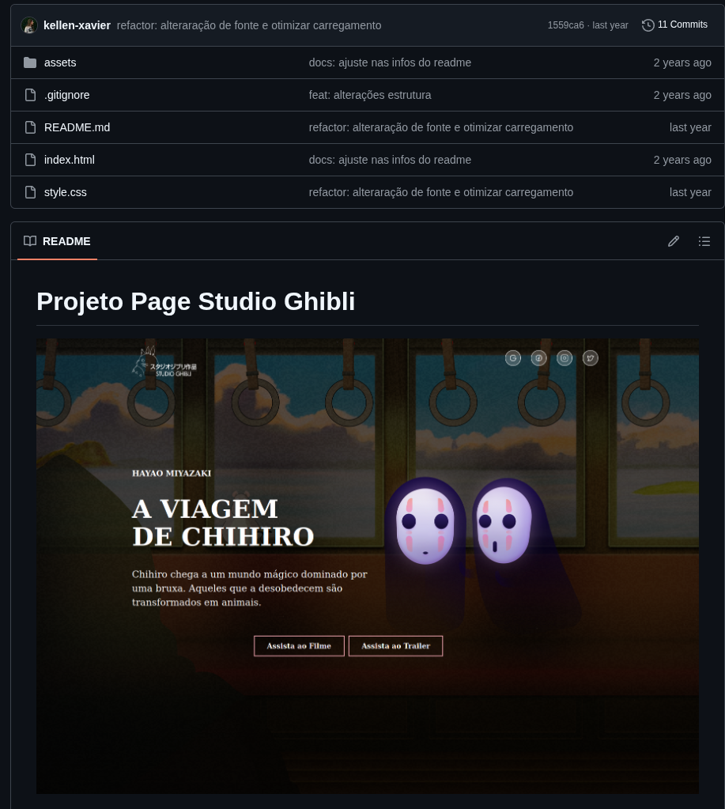
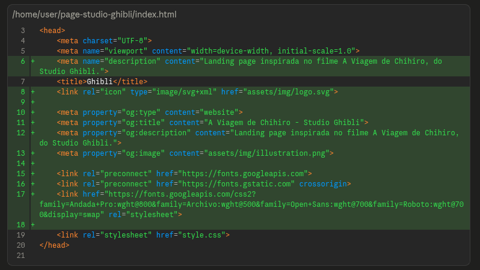
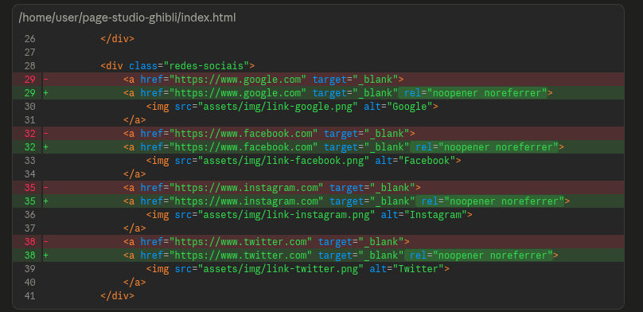
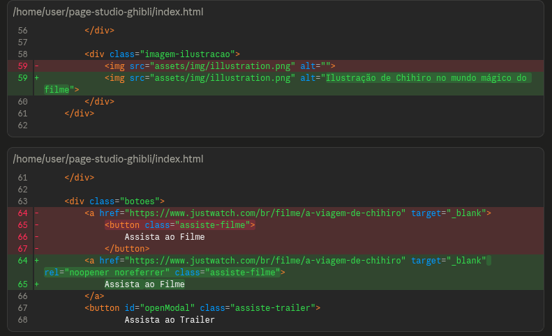
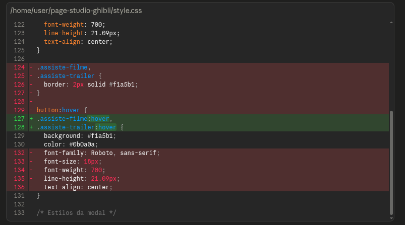
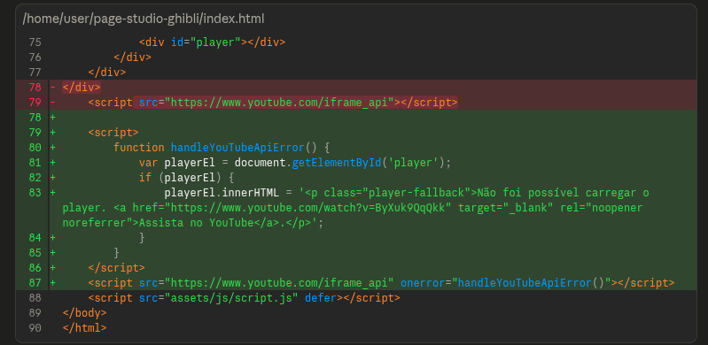
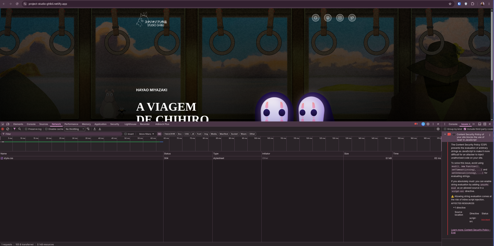
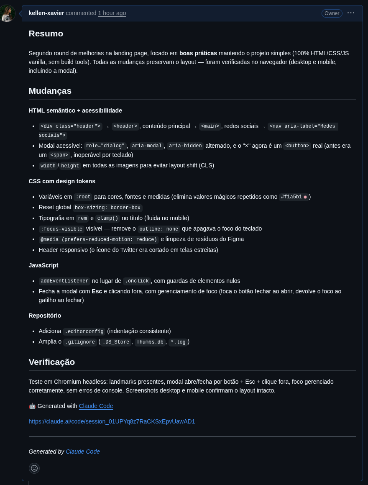

Recentemente fui fazer uma varredura completa no meu github pois fazia muito tempo que eu não dava mais suporte aos meus projetos pessoais.

O selecionado da vez foi o seguinte: <https://github.com/kellen-xavier/page-studio-ghibli> onde eu fiz bem simples uma landing page de um site "divulgação". Com estudos em IA resolvi fazer um refactor nele.

**Objetivo disto:** aplicar estudos com o [Opencode](https://opencode.ai/), estudo com o [claude.ai](http://claude.ai) para realizar alguns testes e economia de tokens (sim, com tarefas bem simples, justamente para por em prova que deve fazer um uso baixo e bom gerenciamento).

— no dia que foi realizado o claude.ai a versão utilizada é o Opus 4.8 —

Esse repositório foi criado há 2 anos atrás, e eu gostaria de fazer alguns ajustes, mas nunca vinha fazer (tempo não dedicado por falta de importância). Também, por ser simples demais, nunca fui muito à frente. Porém é ótimo como porta de entrada para entendimento de frontend simples e como criar landing pages. O bom é que está tudo versionado e fica registrada a evolução aqui.

---

Analisei o repositório completo (HTML, CSS, JS, README e assets). É um projeto estático simples (landing page do filme "A Viagem de Chihiro"). Foram encontrados os seguintes problemas, **organizados por severidade:**

## Bugs funcionais

1. **`index.html:68`** — sobra uma tag `
` sem abertura correspondente (confirmei: 10 `
` abertas vs. 11 `
` fechadas). HTML inválido.
2. **Fontes customizadas nunca são carregadas** — `style.css` usa `Open Sans`, `Andada Pro`, `Archivo` e `Roboto` (linhas 65, 74, 83, 117, 132), mas não existe `<link>` do Google Fonts no `index.html` nem `@font-face` no CSS. O navegador cai para fonte padrão, divergindo do design do Figma.
3. **`style.css:25`** — `.header { width: 1200px; }` não é ajustado na media query mobile (só `.conteudo`, `.botoes`, `button` e a imagem são ajustados em `max-width: 768px`). Em telas médias/pequenas o cabeçalho (logo + redes sociais) estoura horizontalmente e fica cortado (mascarado pelo `overflow-x: hidden`, mas o layout quebra).
4. **`assets/js/script.js:19-22`** — o botão fechar chama `player.stopVideo()` sem checar se `player` já foi inicializado. Se o usuário abrir e fechar o modal antes da API do YouTube carregar, gera `TypeError: Cannot read properties of undefined`.
5. **`style.css:5` e `style.css:37`** — `opacity: 0px` é um valor inválido (opacity não aceita unidade, vai de 0 a 1). Provavelmente resíduo de copy/paste do Figma; a propriedade é simplesmente ignorada pelo navegador.

## Segurança

1. **5 ocorrências de `target="_blank"`** sem `rel="noopener noreferrer"` (`index.html:17, 20, 23, 26, 52`) — vulnerabilidade conhecida de *reverse tabnabbing*, onde a página aberta pode acessar `window.opener` e redirecionar a aba original para um site malicioso.

## Acessibilidade

1. **`index.html:47`** — ``: alt vazio numa imagem de conteúdo (não decorativa). Deveria descrever a cena do filme.
2. **`index.html:52-56`** — `<button>` aninhado dentro de `<a>`. HTML inválido (elementos interativos não podem ser aninhados), pode causar comportamento inconsistente de foco/teclado e leitores de tela.

## Qualidade de código / limpeza

1. **`assets/img/google.png`** — asset morto, não é referenciado em nenhum lugar do HTML/CSS (existe `link-google.png`, que é o realmente usado).
2. **`assets/img/backgraund.png`** — nome de arquivo com erro de digitação (faltando a ordem certa das letras: "background").
3. **`style.css:25-27`** — `.header` usa `width: 1200px` + `padding: 20px` sem `box-sizing: border-box`, então a largura real renderizada é 1240px, desalinhando visualmente com `.conteudo` (1200px, sem padding lateral).
4. **`script.js`** — todas as variáveis (`player`, `openModalBtn`, `modal`, `closeModalBtn`) ficam no escopo global, sem module/IIFE.
5. **`README.md:26`** — seção "Tecnologias e documentações" está vazia. A seção "Colaboração" parece um template genérico de outro projeto (fala em "escolher um template no Figma"), não descreve as tecnologias reais usadas neste repo.

## Itens menores

1. `style.css:92` — `justify-content: left` funciona nos browsers modernos, mas `flex-start` é o valor idiomático/mais compatível em flexbox.
2. Falta favicon, meta description e tags Open Graph no `<head>`.
3. Sem tratamento de erro **caso a API do YouTube não carregue** (ex: bloqueador de anúncios) — o modal abre vazio, sem player nem mensagem.

---

## Correções da Landing Page

O que foi corrigido são coisas bem "chatas" mesmo, mas que impactam significativamente um site estático simples. Ao mesmo tempo que é algo muito simples de fazer, eu particularmente acho tão chato quanto. Mas deve ser corrigido. Ser chato não justifica código sujo.

**Nota Importante**: aqui foi adicionado um script no meio do arquivo `.html`, particularmente ficar enchendo o arquivo de script não é uma melhor opção.

---

Todas as 16 correções foram implementadas, testadas no navegador (Playwright/Chromium, viewports desktop/tablet/mobile) e enviadas para `claude/repo-issues-analysis-136pp3`.

**Resumo do que foi corrigido:**

- **Bugs**: `
` sobrando removido; fontes (Open Sans, Andada Pro, Archivo, Roboto) agora carregam via Google Fonts; overflow horizontal em telas médias corrigido (`.header` e `.conteudo` eram fixos em 1200px — confirmei o overflow real no teste em 900px e corrigi); `player.stopVideo()` agora tem verificação de nulo; `opacity: 0px` inválido removido.
- **Segurança**: `rel="noopener noreferrer"` adicionado em todos os `target="_blank"`.
- **Acessibilidade**: alt-text descritivo na ilustração; `<button>` não fica mais aninhado dentro de `<a>`.
- **Limpeza**: asset `google.png` não utilizado removido; `backgraund.png` renomeado para `background.png`; `box-sizing` corrigido; `script.js` envolvido em IIFE; README com seção de tecnologias preenchida e "Colaboração" ajustada.
- **Extras**: favicon, meta description, Open Graph tags; fallback visual quando a API do YouTube falha ao carregar.

**Correção do primeiro Refactor**: branch `claude/repo-issues-analysis-136pp3`

Link do PR: <https://github.com/kellen-xavier/page-studio-ghibli/pull/1>

**Resultado**

Consideravelmente bem mais rápido.

---

O Claude Code preenche de forma melhor que muito dev aprendiz.

