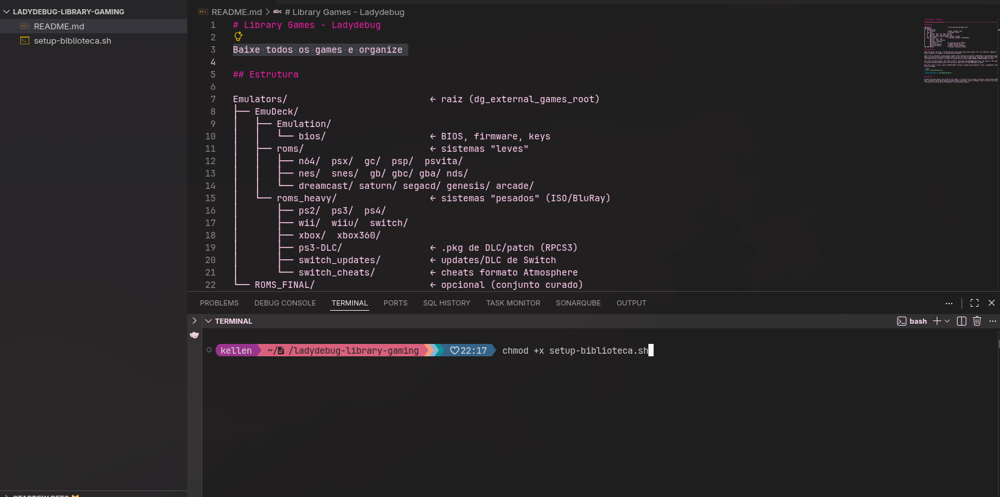

## Baixe todos os games e organize

Estava precisando configurar minhas pastas com os jogos que eu havia baixado — não só recentemente, mas eu já tinha ISO e BIOS — configurada e perdida em pastas diversas pelo computador pessoal e nos drives de nuvem da vida. Resolvi então pegar tudo e organizar de forma centralizada. Criei o script que faz isso de forma prática, ele cria as pastas conforme os jogos de PS1, MEGA, Nintendo etc. Me baseei na organização do repositório aqui: <https://github.com/akitaonrails/distrobox-gaming>

---

Agora a ideia é organizar isso com backup melhor do que eu tenho hoje (eu não tenho) para conservar as ISOs e ROMs.

Próximos passos:
