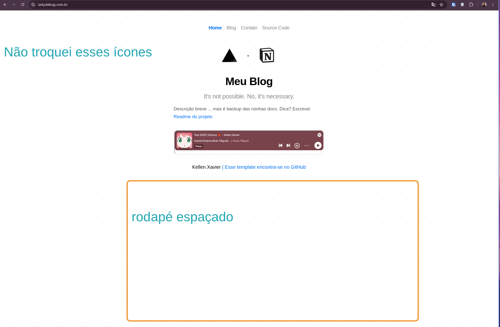
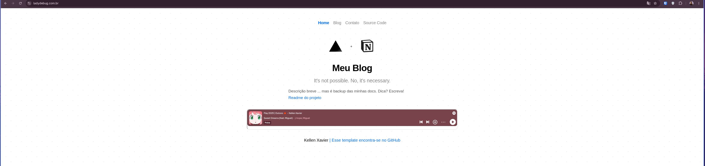

# Análise do repositório `notion-blog`

Meu blog pessoal estava cheio de bugs pois eu só não fiz a devida manutenção que precisava ao longo do período desde que criei — talvez 2 anos. Agora a ideia é corrigir bugs e funcionalidades que eu gostaria de adicionar.



Paginação com erros, demora no carregamento, conteúdo centralizado em ferramenta.

**O que gostaria de melhorar**: descentralizar o conteúdo, organizar o backup rotineiro (por versão), fazer o deploy em dev (não somente em main).

---

## 1. Visão geral

É um **blog estático em Next.js que usa o Notion como CMS/backend**. É um *fork* do template original de [`ijjk/notion-blog`](https://github.com/ijjk/notion-blog), personalizado por mim. O conteúdo dos posts vive em uma tabela do Notion e o site é gerado via **SSG (Static Site Generation)** com revalidação incremental, hospedado na Vercel.

- **Deploy atual:** `https://notion-blog-lake-two.vercel.app/`
- **Branch atual:** `claude/repository-analysis-ieglo6` (idêntica a `develop` — sem diferenças)
- **Licença:** presente (`license`)

## 2. Stack e dependências

<table>
<tr><td>Camada</td><td>Tecnologia</td></tr>
<tr><td>Framework</td><td>Next.js <code>^11.1.2</code> (Pages Router)</td></tr>
<tr><td>UI</td><td>React <code>17</code>, CSS Modules</td></tr>
<tr><td>Linguagem</td><td>TypeScript <code>5.8</code> (com <code>strict: false</code>)</td></tr>
<tr><td>Conteúdo</td><td><strong>API privada não-oficial do Notion</strong> (<code>www.notion.so/api/v3</code>)</td></tr>
<tr><td>Extras</td><td><code>katex</code> (equações), <code>prismjs</code> (syntax highlight), <code>@zeit/react-jsx-parser</code>, <code>async-sema</code> (rate limit), <code>github-slugger</code></td></tr>
<tr><td>Qualidade</td><td>Prettier + lint-staged + pre-commit</td></tr>
<tr><td>Deploy</td><td>Vercel</td></tr>
</table>

## 3. Estrutura

```
src/
├── pages/
│   ├── index.tsx          # Home
│   ├── contact.tsx        # Contato (GitHub/LinkedIn)
│   ├── blog/index.tsx     # Lista de posts (getStaticProps)
│   ├── blog/[slug].tsx    # Renderiza 1 post (getStaticProps/Paths + fallback)
│   └── api/               # asset.ts, preview.ts, preview-post.ts, clear-preview.ts
├── lib/notion/            # Integração com o Notion (rpc, getBlogIndex, getPageData…)
├── lib/build-rss.ts       # Gera feed Atom em /public/atom no build
├── components/            # Header, Footer, Code, Equation, Counter, SVGs, SpotifyPlayer…
└── styles/                # CSS Modules + global.css
scripts/create-table.js    # Cria a tabela-modelo no Notion via API privada
```

## 4. Como funciona (fluxo de dados)

1. **`rpc.ts`** faz POST autenticado no endpoint privado do Notion usando o cookie `token_v2=$NOTION_TOKEN`.
2. **`getBlogIndex`** carrega a tabela (`BLOG_INDEX_ID`), monta o mapa de posts via `getTableData` (que interpreta o *schema* da collection do Notion) e busca *previews* dos 10 posts mais recentes com concorrência limitada a 3 (`async-sema`). Usa cache em disco (`.blog_index_data*`) durante o build (`USE_CACHE`).
3. **`blog/index.tsx`** filtra rascunhos em produção (`Published === 'Yes'`) e lista os posts.
4. **`blog/[slug].tsx`** busca o conteúdo do post (`getPageData` → `loadPageChunk` paginado), resolve embeds de tweets, e faz um *switch* gigante convertendo cada tipo de bloco do Notion (text, header, image, code, quote, callout, equation, bookmark, tweet…) em JSX.
5. **`api/asset.ts`** funciona como proxy: pega a URL assinada do arquivo no Notion (`getSignedFileUrls`) e redireciona (307) para servir imagens/vídeos.
6. **`build-rss.ts`** roda no build e gera o feed Atom em `public/atom`.
7. **Preview mode**: `api/preview.ts` e `preview-post.ts` habilitam o modo rascunho do Next.

## 5. Pontos fortes

- Arquitetura enxuta e bem separada (lib/pages/components).
- Uso correto de SSG + `revalidate` (ISR) e `fallback: true`.
- Rate-limiting no fetch de previews e cache de build.
- Suporte rico a blocos do Notion (equações KaTeX, código com Prism, callouts, bookmarks, vídeo, tweets).
- Ferramentas de formatação já configuradas (Prettier/lint-staged).

## 6. Problemas e riscos que encontrei

**Segurança / prático**

- **`NOTION_TOKEN` usado como senha de preview**: `preview.ts` e `preview-post.ts` comparam `req.query.token === process.env.NOTION_TOKEN`. Isso coloca o **token secreto do Notion na URL** (fica em logs, histórico, referrers). Deveria ser um segredo separado (`NEXT_PREVIEW_SECRET`).
- **API privada do Notion** (`token_v2` + `/api/v3`): não é oficial, pode quebrar a qualquer momento e o token é a sua sessão pessoal. O ideal moderno é migrar para a **API oficial do Notion** (`@notionhq/client`).
- **`api/asset.ts` é um proxy aberto** (`Access-Control-Allow-Origin: *`) que assina URLs para qualquer `assetUrl`/`blockId` recebido — vale restringir.

**Dependências não declaradas**

- `node-fetch`, `@next/env` e `shell-quote` são **importados mas não constam no `package.json`** (funcionam só por dependência transitiva/hoisting). Isso é frágil e pode quebrar o build com um lockfile limpo. Devem ser adicionados como dependências explícitas.

**Restos do template original (branding inconsistente)**

- `header.tsx`: link "Source Code" e OG image apontam para `ijjk/notion-blog` e `notion-blog.now.sh` (domínio `now.sh` desativado), twitter `@_ijjk`.
- `footer.tsx`: link para o repo do `ijjk`.
- `index.tsx`: ainda usa a imagem/branding "Vercel + Notion".
- Metadados/`<title>` genéricos ("My Notion Blog", "An example Next.js site…").
- **Idiomas misturados** (PT + EN) na interface.

**Código potencialmente quebrado/frágil**

- **Embed de tweets** usa `api.twitter.com/1/statuses/oembed.json` (API v1, **descontinuada**) — provavelmente já não funciona.
- `[slug].tsx` usa `unstable_revalidate` (API antiga, **ignorada** no Next 11) junto com `revalidate`.
- `equation.tsx`: `render()` pode retornar `undefined` se o erro **não** for `ParseError` (a variável `result` nunca é atribuída).
- `getPageData` remove blocos de tabela com `splice(0, 3)` fixo — quebradiço.
- **Incoerência de versão de Node**: o `readme` pede Node `>=18`, mas `getBlogIndex.ts` usa `Array.prototype.toSorted()` que exige **Node 20+**. Já `vercel.json` força `-openssl-legacy-provider` (workaround de build antigo). Recomendo fixar Node 20 explicitamente.

**Qualidade / manutenção**

- `tsconfig` com `strict: false` (perde segurança de tipos; muito `any`).
- **Sem testes** e **sem CI** (`.github/` ausente).
- README com pequenos erros (crases `´´´` em vez de ```` ``` ````).

## 7. Recomendações priorizadas

1. **Trocar o segredo de preview** por uma variável dedicada (não reusar `NOTION_TOKEN` na URL).
2. **Declarar `node-fetch`, `@next/env`, `shell-quote`** no `package.json`.
3. **Atualizar o branding**: links, OG image, título e twitter para os meus (remover resíduos do `ijjk`/`now.sh`).
4. **Corrigir/remover o embed de tweets** (API v1 morta) e o `unstable_revalidate`.
5. **Alinhar a versão do Node** (fixar `engines: node >=20`) por causa do `toSorted()`.
6. (Médio prazo) **Migrar para a API oficial do Notion** e considerar atualizar o Next.js (11 → recente) para segurança e performance.

---

## Correções no Blog



Primeiro foi solicitado para realizar uma análise utilizando o claude.ai, seguindo foi escrito o seguinte script.

> 📚 claude/repository-analysis-ieglo6? Posso começar pelas de baixo risco e alto impacto (dependências no package.json, branding, segredo de preview e os bugs pequenos). Como esta foi uma tarefa de análise, não fiz nenhuma alteração ainda.
>
> Faça as implementações da seguinte forma.
> - Corrija os pontos, sempre realizando os testes necessários, não deve implementar sem testar.
> - Após testes de validação, abra PRs
> - Quando tiver uma atualização delicada, deve ter atenção aos pontos para não quebrar em produção.
> - Deve documentar as alterações somente no meu repositório kellen-xavier
> - Deve criar a pasta /docs para uso de documentação
> - Não deve compartilhar chaves e dados sensíveis - isso inclui documentações, README.md
> - Criar um setup .agents no repositório, para adicionar informações persistentes
> - Deve incluir no setup o arquivo .AGENTS.md
>
> Para cada step dado aqui, tenha atenção e testes.

<table>
<tr><td><strong>Etapa</strong></td><td><strong>Mudança</strong></td><td><strong>Validação</strong></td></tr>
<tr><td><strong>Dependências</strong></td><td>Declarei <code>node-fetch@2.6.1</code>, <code>@next/env@11.1.2</code>, <code>shell-quote@1.7.2</code> (dev) e <code>@types/node-fetch</code>; adicionei <code>engines.node >=20</code> e scripts <code>typecheck</code>/<code>test</code></td><td><code>tsc</code> verde</td></tr>
<tr><td><strong>Segurança (delicado)</strong></td><td><code>PREVIEW_TOKEN</code> dedicado em <a href="https://github.com/kellen-xavier/notion-blog/blob/claude/repository-analysis-ieglo6/src/lib/preview-auth.ts"><code>src/lib/preview-auth.ts</code></a>, <strong>com fallback</strong> para <code>NOTION_TOKEN</code> para não quebrar produção</td><td>4 testes (401/404/ok/fallback)</td></tr>
<tr><td><strong>Branding</strong></td><td>Removidos resíduos <code>ijjk</code>/<code>now.sh</code> de header/footer/server-constants</td><td>teste de regressão</td></tr>
<tr><td><strong>Bugs</strong></td><td><code>equation.render</code> nunca retorna <code>undefined</code>; <code>unstable_revalidate</code>→<code>revalidate</code>; oembed de tweet v1 morto → <code>publish.twitter.com</code></td><td>teste do render + build</td></tr>
<tr><td><strong>Docs</strong></td><td><code>/docs</code> (SETUP, ARCHITECTURE, SECURITY, CHANGELOG) — só no meu repo</td><td>—</td></tr>
<tr><td><strong>Agentes</strong></td><td><code>AGENTS.md</code> na raiz + <code>.agents/</code> (contexto + convenções persistentes)</td><td>—</td></tr>
</table>

- `.AGENTS.md` (com ponto): usei a convenção padrão `AGENTS.md` na raiz (é o nome que as ferramentas de agente reconhecem) + a pasta `.agents/` para o setup persistente.
- O PR foi aberto contra **`develop`** (branch padrão do repo), em 4 commits temáticos.
